**Chương 1. Giới thiệu**

## Lý do chọn đề tài

Công nghệ thông tin là tập hợp các phương pháp khoa học và các công cụ
kỹ thuật hiện đại, chủ yếu là kỹ thuật máy tính và viễn thông nhằm tổ
chức khai thác và sử dụng có hiệu quả các nguồn tài nguyên thông tin
phong phú, tiềm năng trong mọi lĩnh vực hoạt động của con người và xã
hội.

[Ngày nay](https://www.facebook.com/groups/332405046938901/), công nghệ
thông tin phát triển nhanh chóng và ứng dụng vào tất cả các lĩnh vực, có
thể nói công nghệ thông tin trở thành thước đo để đánh giá sự phát triển
của xã hội hiện đại -- nơi mà con người đang từ bỏ cách làm việc thủ
công, tiến đến tin học hóa trong tất cả các lĩnh vực, để công việc thực
hiện có hiệu quả hơn, tiết kiệm thời gian và nhân lực hơn.

Do đó ứng dụng của công nghệ thông tin vào việc quản lý dường như không
còn xa lạ với các doanh nghiệp. Lợi ích mà các phần mềm quản lý đem lại
khiến ta không thể không thừa nhận tính hiệu quả của nó mà phần mềm quản
lý hàng hoá là một trong số đó. Khi quản lý đòi hỏi sự chính xác tuyệt
đối trong tính toán, cập nhật thông tin một cách nhanh chóng, giúp người
quản lý tiết kiệm được thời gian, công sức cũng như hiệu quả cao trong
công việc.

Là sinh viên được trang bị những kiến thức của ngành hệ thống thông tin
với những kiến thức đã tiếp thu và vận dụng lý thuyết đó vào công việc
thực tế nên em đã chọn đề tài "***Xây dựng wesite quản lý quán cafe
THECOFFEE247 và tìm kiếm món ăn hot trend hiện tại***" để thực hiện đồ
án tốt nghiệp của mình với mục đích nghiên cứu và xây dựng một hệ thống
thông tin có thể quản lý được số lượng, thông tin và tình trạng của cửa
hàng, giúp người quản lý tiết kiệm được thời gian, công sức cũng như
hiệu quả cao trong công việc.

1.  **Mục tiêu của đề tài**

\- Xây dựng wesite quản lý quán cafe THECOFFEE247 và tìm kiếm món ăn hot
trend hiện tại

\- Triển khai và cài đặt chương trình trong thực tế.

2.  **Giới hạn và phạm vi của đề tài**

Trong phạm vi đề tài này em sẽ nghiên cứu các vấn đề:

> \- Nghiên cứu về công tác quản lý hàng hóa của doanh nghiệp, đi sâu
> vào nghiên cứu và phân tích một hệ thống thông tin để xây dựng ứng
> dụng.

\- Ứng dụng được xây dựng bằng ngôn ngữ lập trình TypeScript và cơ sở dữ
liệu xây dựng bằng PostgreSQL.

3.  **Kết quả dự kiến đạt được**

Hệ thống thông tin quản lý hàng hóa của khi hoàn thành dự kiến đạt được
các kết quả sau:

\- Phân tích hệ thống quản lí hàng hóa theo đúng yêu cầu nghiệp vụ của
doanh nghiệp.

\- Hoàn thành cài đặt phần mềm quản lí với các chức năng chính sau:

\+ Cập nhật dữ liệu thông tin cho hệ thống.

\+ Người dùng có thể xem được thông tin về sản phẩm,thông tin liên hệ
của quán

\+ Nhân viên có thể tạo và quản lý đơn hàng cho khách tại quầy, bao gồm
lựa chọn hình thức phục vụ (tại chỗ, mang về), thêm món, cập nhật số
lượng, tính tiền và xử lý thanh toán với các phương thức như tiền mặt
hoặc chuyển khoản.

\+ Quản lý và nhân viên có thể tìm kiếm thông tin về hàng hóa.

-   Xem tất cả thông tin, hiện trạng về hàng hóa: theo tên mặt hàng, mã
    mặt hàng, giá tiền, số lượng , tình trạng, date, công dụng, .v.v\...

```{=html}
<!-- -->
```
-   Tìm kiếm hàng hóa: theo tên mặt hàng, theo mã mặt hàng,...

-   Phiếu xuất hàng, phiếu nhập hàng.

> \+ Quản lý có thể xem báo cáo thống kê.

-   Thống kê tình trạng hàng hóa tồn kho theo tháng, quý, năm.

-   Thống kê tình trạng và số lượng hàng hóa xuất, nhập khẩu theo mặt
    hàng.

```{=html}
<!-- -->
```
-   Hoàn thành báo cáo chi tiết đồ án tốt nghiệp.

## CHƯƠNG 2: CƠ SỞ LÝ THUYẾT VÀ CÔNG NGHỆ {#chương-2-cơ-sở-lý-thuyết-và-công-nghệ .unnumbered}

### 2.1. Nền tảng Frontend {#nền-tảng-frontend .unnumbered}

#### 2.1.1. ReactJS {#reactjs .unnumbered}

{width="4.432638888888889in"
height="2.488888888888889in"}

ReactJS là thư viện JavaScript mã nguồn mở do Meta phát triển, cho phép
xây dựng giao diện người dùng theo mô hình component-based. Mỗi thành
phần giao diện được đóng gói độc lập, giúp tái sử dụng mã nguồn hiệu
quả, dễ kiểm thử và bảo trì trong các dự án quy mô lớn.

#### 2.1.2. Next.js {#next.js .unnumbered}

{width="4.2972222222222225in"
height="2.453472222222222in"}

Next.js là framework xây dựng trên nền ReactJS, bổ sung các cơ chế
render nâng cao gồm Server-Side Rendering (SSR) và Static Site
Generation (SSG), góp phần tối ưu hóa hiệu suất tải trang và cải thiện
khả năng SEO. Hệ thống App Router của Next.js cung cấp cơ chế định tuyến
linh hoạt, hỗ trợ phân chia code tự động và quản lý trạng thái phía máy
chủ một cách hiệu quả.

#### 2.1.3. Tailwind CSS {#tailwind-css .unnumbered}

{width="3.175in"
height="1.9048611111111111in"}

Tailwind CSS là framework CSS theo hướng tiện ích (utility-first), cho
phép xây dựng giao diện nhất quán và có tính đáp ứng (responsive) mà
không cần rời khỏi tệp HTML/JSX. Cách tiếp cận này rút ngắn đáng kể thời
gian phát triển giao diện, đồng thời giúp duy trì sự đồng nhất về mặt
thiết kế xuyên suốt toàn bộ ứng dụng.

#### 2.1.4. TypeScript {#typescript .unnumbered}

{width="3.1125in"
height="1.6368055555555556in"}

TypeScript là phiên bản mở rộng có kiểu tĩnh (statically typed) của
JavaScript, được áp dụng nhằm tăng cường độ an toàn kiểu dữ liệu (type
safety) và phát hiện lỗi sớm ngay trong quá trình biên dịch. TypeScript
đặc biệt hữu ích trong việc kiểm soát chặt chẽ cấu trúc dữ liệu khi gọi
API, đồng thời nâng cao khả năng bảo trì và mở rộng dự án về lâu dài.

### 2.2. Nền tảng Backend và Cơ sở dữ liệu {#nền-tảng-backend-và-cơ-sở-dữ-liệu .unnumbered}

#### 2.2.1. Java Spring Boot {#java-spring-boot .unnumbered}

{width="3.3722222222222222in"
height="1.8881944444444445in"}

Spring Boot là framework phát triển ứng dụng Java dựa trên nền tảng
Spring Framework, cho phép khởi tạo và triển khai ứng dụng nhanh chóng
với cấu hình tối giản theo nguyên tắc \"convention over configuration\".
Hệ thống backend được xây dựng theo kiến trúc MVC
(Model--View--Controller), trong đó Spring Boot đảm nhận vai trò cung
cấp các RESTful API có cấu trúc rõ ràng, phục vụ giao tiếp giữa tầng
giao diện và tầng dữ liệu.

#### s {#s .unnumbered}

#### 2.2.2. PostgreSQL {#postgresql .unnumbered}

PostgreSQL là hệ quản trị cơ sở dữ liệu quan hệ mã nguồn mở, được lựa
chọn nhờ khả năng xử lý giao dịch đáng tin cậy theo chuẩn ACID, hỗ trợ
các kiểu dữ liệu phong phú và cơ chế ràng buộc toàn vẹn dữ liệu chặt
chẽ. PostgreSQL phù hợp với yêu cầu lưu trữ và truy vấn dữ liệu có cấu
trúc phức tạp, đảm bảo tính nhất quán và độ tin cậy cao cho hệ thống.

###  {#section .unnumbered}

## CHƯƠNG 3: PHÂN TÍCH VÀ THIẾT KẾ HỆ THỐNG {#chương-3-phân-tích-và-thiết-kế-hệ-thống .unnumbered}

### 3.1. Khảo sát hệ thống

#### 3.1.1. Giới thiệu đơn vị khảo sát
- **Đơn vị khảo sát:** Quán cafe THECOFFEE247.
- **Hoạt động:** Phục vụ khách hàng với đa dạng các loại đồ uống, cafe và đặc biệt là các món ăn "hot trend" hiện tại. Hoạt động từ sớm đến tối muộn, phục vụ khách hàng dùng tại chỗ và mang đi.
- **Quy mô:** Không gian thiết kế thoải mái, chia thành nhiều khu vực bàn phục vụ, phù hợp với mọi lứa tuổi khách hàng.

#### 3.1.2. Khảo sát quy trình của cửa hàng
THECOFFEE247 là đơn vị kinh doanh dịch vụ F&B (Ăn uống) với danh mục sản phẩm phong phú. Hoạt động bán hàng được triển khai linh hoạt qua hình thức bán trực tiếp tại quầy, phục vụ tại bàn và hỗ trợ mua mang đi (Takeaway). Về phương thức thanh toán, quán hỗ trợ đa dạng từ tiền mặt, thanh toán động qua mã QR (dynamic QR Momo), và thanh toán thẻ qua Paypal, đảm bảo tính thuận tiện, nhanh chóng. Tuy nhiên, sự phối hợp giữa bộ phận order, pha chế và thu ngân vào giờ cao điểm cần được tối ưu thông qua phần mềm để tránh sai sót và quá tải.

##### 3.1.2.1. Hình thức khảo sát
- Phỏng vấn
- Quan sát hiện trường
- Nghiên cứu tài liệu

##### 3.1.2.2. Đối tượng khảo sát
- **Nhân viên bán hàng:** Lê Bá Phú, Nguyễn Văn Đức.
- **Người quản lý:** Lê Tuấn Anh.
- **Người phỏng vấn:** Hoàng Mạnh Hoàn.

*Phỏng vấn nhân viên bán hàng:*
Ngày phỏng vấn: 01/04/2026
Nội dung phỏng vấn: Nghiệp vụ và công việc của nhân viên bán hàng

| STT | Câu hỏi | Câu trả lời của nhân viên | Ghi chú |
|-----|---------|---------------------------|---------|
| 1 | Cửa hàng bán các sản phẩm nào? | Quán phục vụ khách hàng với nhiều loại cafe, đồ uống và các món ăn hot trend hiện tại. | |
| 2 | Khi khách hàng đến cửa hàng, quy trình đón tiếp và tư vấn khách như thế nào? | Khách đến cửa hàng sẽ được mời vào bàn hoặc đặt tại quầy; nhân viên sẽ giới thiệu menu, các món mới hoặc hot trend phù hợp với nhu cầu của khách. | |
| 3 | Các phương thức bán hàng của quán? | Hiện tại quán đang phục vụ dùng tại bàn (dine-in) và bán mang về (takeaway). | |
| 4 | Khách hàng có được hưởng ưu đãi gì không? | Có đối với khách hàng thân thiết sẽ được tặng voucher giảm giá cho lần mua tiếp theo tại cửa hàng. | |
| 5 | Anh/chị tiếp nhận thanh toán bằng những hình thức nào? | Khách hàng có nhiều lựa chọn thanh toán khác nhau như tiền mặt, dynamic QR Momo, và thanh toán thẻ Paypal. | |
| 6 | Trong quá trình làm việc, anh/chị thường gặp khó khăn gì? | Hiện tại, việc quản lý hóa đơn, chuyển đơn cho pha chế và theo dõi trạng thái bàn đôi khi còn thủ công hoặc chưa đồng bộ, dẫn đến quá tải khi đông khách. Việc thanh toán nhiều hình thức cũng cần thao tác nhanh chóng hơn. | |

*Phỏng vấn người quản lý:*
Ngày phỏng vấn: 01/04/2026
Người được phỏng vấn: Lê Tuấn Anh

| STT | Câu hỏi | Câu trả lời của người quản lý | Ghi chú |
|-----|---------|------------------------------|---------|
| 1 | Anh/chị có thể mô tả quy trình quản lý hoạt động hàng ngày của cửa hàng? | Ca làm việc từ sáng sớm đến tối muộn. Công việc bao gồm phân công nhân viên, dọn dẹp, kiểm tra nguyên liệu, và quản lý các khu vực bàn phục vụ. | |
| 2 | Anh/chị theo dõi doanh thu và số lượng đơn hàng trong ngày bằng cách nào? | Hiện tại chủ yếu theo dõi doanh số và đơn hàng qua sổ sách và tổng kết cuối ngày, đôi khi gặp sai sót nếu lượng đơn quá lớn. | |
| 3 | Nếu được xây dựng một phần mềm quản lý mới, anh/chị mong muốn có những tính năng gì? | Chúng tôi cần một hệ thống quản lý có thể tối ưu việc order từ bàn đến quầy pha chế, tích hợp sẵn các phương thức thanh toán Momo/Paypal, đảm bảo bảo mật và cung cấp các báo cáo thống kê doanh thu theo ngày, tháng, năm để nắm bắt tình hình và đưa ra chiến lược kinh doanh. | |

#### 3.1.3. Mô tả bài toán và lên kế hoạch cho dự án
##### 3.1.3.1. Mô tả về hệ thống cần xây dựng
**a. Đánh giá ưu nhược điểm của việc quản lý truyền thống**
- **Ưu điểm:** Chi phí thấp ban đầu, dễ triển khai, nhân viên quen thuộc với việc ghi chép.
- **Nhược điểm:** Tốn thời gian & dễ sai sót khi nhập liệu, lên đơn chậm vào giờ cao điểm, khó kiểm soát trạng thái các bàn (bàn trống/bàn có khách), và báo cáo doanh thu cuối ngày mất nhiều thời gian tổng hợp.

**b. Nhu cầu phát triển phần mềm quản lý thay thế**
- Tối ưu hóa quy trình order tại bàn và takeaway.
- Hỗ trợ đa dạng phương thức thanh toán như tiền mặt, mã QR Momo (dynamic QR) và Paypal để tiết kiệm thời gian.
- Phân quyền & Bảo mật hệ thống giữa Quản lý và Nhân viên.
- Báo cáo & Phân tích thông minh doanh thu, đơn hàng theo ngày/tháng/năm.

**c. Phát biểu bài toán**
Xây dựng một hệ thống website quản lý quán cafe THECOFFEE247 và tìm kiếm món ăn hot trend.
- **Khách hàng:** Tìm kiếm thông tin sản phẩm, xem menu (cafe, đồ ăn hot trend), xem thông tin liên hệ.
- **Nhân viên:** Tạo và quản lý đơn hàng cho khách tại quầy (dùng tại chỗ, mang về), thêm món, cập nhật số lượng, in hóa đơn, xử lý thanh toán (tiền mặt, Momo, Paypal).
- **Quản lý:** Quản lý tài khoản, thêm/sửa/xóa thông tin sản phẩm/cấu hình/danh mục, quản lý bàn, theo dõi trạng thái, tạo khuyến mãi/voucher và xem báo cáo thống kê doanh thu.

##### 3.1.3.2. Đề xuất chức năng cho hệ thống
Hệ thống website quản lý THECOFFEE247 dự kiến có các chức năng sau:
- **Chức năng 1:** Quản lý nhập xuất tài khoản (Đăng nhập, đăng xuất, đăng ký).
- **Chức năng 2:** Quản lý người dùng (Quản lý tài khoản nhân viên/khách hàng).
- **Chức năng 3:** Quản lý sản phẩm (Thêm/sửa/xóa đồ uống, món ăn).
- **Chức năng 4:** Quản lý danh mục sản phẩm.
- **Chức năng 5:** Quản lý bàn (Thêm/sửa/xóa bàn, theo dõi trạng thái bàn trống/có khách).
- **Chức năng 6:** Quản lý đơn hàng (Tạo đơn, cập nhật trạng thái chế biến).
- **Chức năng 7:** Quản lý thanh toán (Ghi nhận thanh toán tiền mặt, Momo, Paypal).
- **Chức năng 8:** Quản lý khuyến mãi/Voucher.
- **Chức năng 9:** Thống kê doanh thu (Theo ngày, tháng, năm).

### 3.2. Sơ đồ Use Case (Tình huống sử dụng) {#sơ-đồ-use-case-tình-huống-sử-dụng .unnumbered}

#### 3.2.1. Use Case Tổng quan {#use-case-tổng-quan .unnumbered}


        


####  {#section-1 .unnumbered}

#### 3.2.2. Use Case Chi tiết - Xác thực & Tài khoản {#use-case-chi-tiết---xác-thực-tài-khoản .unnumbered}

**UC01 -- Đăng nhập hệ thống**

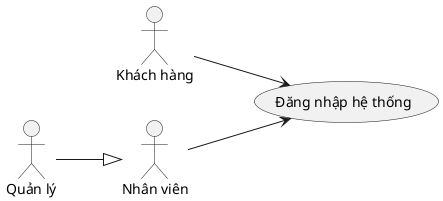

  -----------------------------------------------------------------------
  Thuộc tính                          Nội dung
  ----------------------------------- -----------------------------------
  **Use Case ID**                     UC01

  **Tên Use Case**                    Đăng nhập hệ thống

  **Actor**                           Nhân viên, Quản lý, Khách hàng

  **Mô tả**                           Người dùng xác thực danh tính qua
                                      tài khoản nội bộ (Local) hoặc
                                      Google OAuth2 để truy cập hệ thống

  **Tiền điều kiện**                  Người dùng đã mở ứng dụng và có tài
                                      khoản hợp lệ trong hệ thống

  **Hậu điều kiện**                   Hệ thống cấp JWT Token, người dùng
                                      được chuyển đến Dashboard tương ứng
                                      với vai trò

  **Luồng chính**                     1\. Người dùng truy cập trang đăng
                                      nhập. 2. Nhập tên đăng nhập và mật
                                      khẩu (hoặc nhấn "Đăng nhập bằng
                                      Google"). 3. Hệ thống xác thực
                                      thông tin với cơ sở dữ liệu. 4. Hệ
                                      thống tạo JWT Token và lưu vào
                                      session. 5. Chuyển hướng người dùng
                                      đến trang Dashboard.

  **Luồng thay thế / Ngoại lệ**       \[A1\] Sai thông tin đăng nhập:
                                      Hiển thị thông báo lỗi, yêu cầu
                                      nhập lại. \[A2\] Đăng nhập Google
                                      thất bại: Hiển thị lỗi OAuth2, quay
                                      về trang đăng nhập. \[A3\] Tài
                                      khoản bị vô hiệu hóa: Hiển thị "Tài
                                      khoản đã bị khóa".

  **Quy tắc kinh doanh**              Mật khẩu được so khớp với bản băm
                                      BCrypt trong DB. Tài khoản Google
                                      không thể đăng nhập bằng Local và
                                      ngược lại.
  -----------------------------------------------------------------------

**UC02 -- Đăng ký tài khoản**

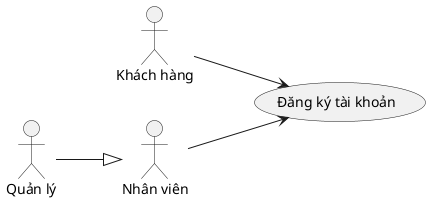

  -----------------------------------------------------------------------
  Thuộc tính                          Nội dung
  ----------------------------------- -----------------------------------
  **Use Case ID**                     UC02

  **Tên Use Case**                    Đăng ký tài khoản

  **Actor**                           Khách hàng, Nhân viên, Quản lý

  **Mô tả**                           Người dùng tạo tài khoản mới bằng
                                      thông tin cá nhân

  **Tiền điều kiện**                  Người dùng chưa có tài khoản và đã
                                      mở trang đăng ký

  **Hậu điều kiện**                   Tài khoản mới được tạo với trạng
                                      thái kích hoạt, người dùng được
                                      chuyển đến trang đăng nhập

  **Luồng chính**                     1\. Người dùng truy cập trang đăng
                                      ký. 2. Điền đầy đủ: họ tên, email,
                                      số điện thoại, mật khẩu. 3. Hệ
                                      thống kiểm tra tính hợp lệ của dữ
                                      liệu. 4. Hệ thống kiểm tra email
                                      chưa tồn tại. 5. Tạo tài khoản mới
                                      với `provider=LOCAL`. 6. Chuyển
                                      hướng về trang đăng nhập với thông
                                      báo thành công.

  **Luồng thay thế / Ngoại lệ**       \[A1\] Email đã tồn tại: Hiển thị
                                      "Email đã được sử dụng". \[A2\] Dữ
                                      liệu không hợp lệ: Hiển thị lỗi
                                      validation tại từng trường.

  **Quy tắc kinh doanh**              Mật khẩu tối thiểu 8 ký tự. Email
                                      phải đúng định dạng. Mỗi email chỉ
                                      được đăng ký một tài khoản.
  -----------------------------------------------------------------------

**UC03 -- Quên mật khẩu**

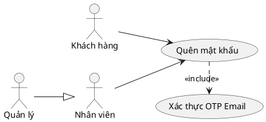

  -----------------------------------------------------------------------
  Thuộc tính                          Nội dung
  ----------------------------------- -----------------------------------
  **Use Case ID**                     UC03

  **Tên Use Case**                    Quên mật khẩu

  **Actor**                           Nhân viên, Quản lý, Khách hàng

  **Mô tả**                           Người dùng khởi tạo quy trình lấy
                                      lại mật khẩu qua email

  **Tiền điều kiện**                  Người dùng có tài khoản Local và
                                      biết địa chỉ email đã đăng ký

  **Hậu điều kiện**                   Mật khẩu mới được lưu trong hệ
                                      thống, người dùng có thể đăng nhập
                                      bằng mật khẩu mới

  **Luồng chính**                     1\. Nhấn "Quên mật khẩu" tại trang
                                      đăng nhập. 2. Nhập địa chỉ email đã
                                      đăng ký. 3. Hệ thống kiểm tra email
                                      và gửi mã OTP (\<\> UC04). 4. Người
                                      dùng nhập OTP nhận được qua email.
                                      5. Người dùng nhập mật khẩu mới và
                                      xác nhận. 6. Hệ thống lưu mật khẩu
                                      mới.

  **Luồng thay thế / Ngoại lệ**       \[A1\] Email không tồn tại: Hiển
                                      thị "Không tìm thấy tài khoản".
                                      \[A2\] OTP hết hạn: Yêu cầu gửi lại
                                      mã. \[A3\] OTP sai: Hiển thị lỗi,
                                      cho phép nhập lại.

  **Quy tắc kinh doanh**              OTP có hiệu lực 5 phút. Mật khẩu
                                      mới không được trùng mật khẩu cũ.
                                      Chỉ áp dụng cho tài khoản
                                      `provider=LOCAL`.
  -----------------------------------------------------------------------

**UC04 -- Xác thực OTP Email**

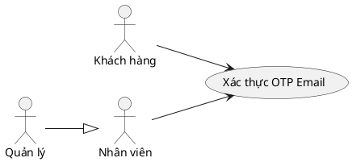

  -----------------------------------------------------------------------
  Thuộc tính                          Nội dung
  ----------------------------------- -----------------------------------
  **Use Case ID**                     UC04

  **Tên Use Case**                    Xác thực OTP Email

  **Actor**                           Hệ thống (được kích hoạt bởi UC03
                                      hoặc UC05)

  **Mô tả**                           Hệ thống tạo và gửi mã OTP đến
                                      email người dùng để xác minh danh
                                      tính trong các thao tác nhạy cảm

  **Tiền điều kiện**                  Người dùng đã yêu cầu quên mật khẩu
                                      (UC03) hoặc cập nhật thông tin cá
                                      nhân (UC05)

  **Hậu điều kiện**                   OTP được xác thực thành công, hệ
                                      thống cho phép tiếp tục thao tác

  **Luồng chính**                     1\. Hệ thống sinh mã OTP ngẫu nhiên
                                      6 chữ số. 2. Lưu OTP vào database
                                      kèm thời gian hết hạn. 3. Gửi OTP
                                      đến địa chỉ email người dùng. 4.
                                      Người dùng nhập mã OTP vào form. 5.
                                      Hệ thống so khớp OTP và kiểm tra
                                      thời hạn.

  **Luồng thay thế / Ngoại lệ**       \[A1\] OTP hết hạn: Thông báo hết
                                      hạn, cho phép gửi lại. \[A2\] OTP
                                      không đúng: Thông báo sai mã, cho
                                      phép nhập lại tối đa 3 lần.

  **Quy tắc kinh doanh**              OTP gồm 6 chữ số, hiệu lực 5 phút.
                                      Mỗi lần gửi OTP mới sẽ vô hiệu hóa
                                      OTP cũ.
  -----------------------------------------------------------------------

**UC05 -- Quản lý thông tin cá nhân**

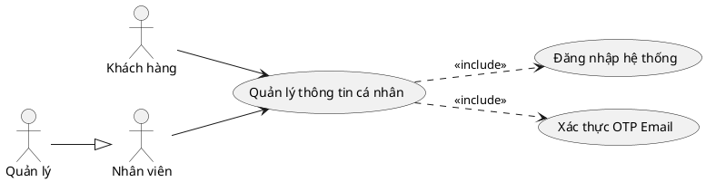

  -----------------------------------------------------------------------
  Thuộc tính                          Nội dung
  ----------------------------------- -----------------------------------
  **Use Case ID**                     UC05

  **Tên Use Case**                    Quản lý thông tin cá nhân

  **Actor**                           Nhân viên, Quản lý

  **Mô tả**                           Người dùng xem và cập nhật hồ sơ cá
                                      nhân (tên, email, số điện thoại) có
                                      xác thực OTP

  **Tiền điều kiện**                  Người dùng đã đăng nhập vào hệ
                                      thống

  **Hậu điều kiện**                   Thông tin cá nhân được cập nhật
                                      trong hệ thống

  **Luồng chính**                     1\. Truy cập trang "Hồ sơ cá nhân".
                                      2. Hệ thống hiển thị thông tin hiện
                                      tại. 3. Người dùng chỉnh sửa các
                                      trường muốn cập nhật. 4. Nhấn "Lưu
                                      thay đổi". 5. Hệ thống gửi OTP xác
                                      thực qua email (\<\> UC04). 6.
                                      Người dùng nhập OTP. 7. Hệ thống
                                      cập nhật thông tin vào database.

  **Luồng thay thế / Ngoại lệ**       \[A1\] Email mới đã tồn tại: Hiển
                                      thị lỗi, yêu cầu nhập email khác.
                                      \[A2\] OTP không hợp lệ: Hiển thị
                                      lỗi, yêu cầu nhập lại.

  **Quy tắc kinh doanh**              Email mới phải chưa tồn tại trong
                                      hệ thống. Số điện thoại phải đúng
                                      định dạng Việt Nam (10 số).
  -----------------------------------------------------------------------

#### 3.2.3. Use Case Chi tiết - Vận hành Bán hàng {#use-case-chi-tiết---vận-hành-bán-hàng .unnumbered}

**UC06 -- Xem trạng thái Bàn**

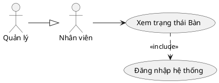

  -----------------------------------------------------------------------
  Thuộc tính                          Nội dung
  ----------------------------------- -----------------------------------
  **Use Case ID**                     UC06

  **Tên Use Case**                    Xem trạng thái Bàn

  **Actor**                           Nhân viên, Quản lý

  **Mô tả**                           Xem danh sách các bàn cùng trạng
                                      thái (trống / có khách) để điều
                                      phối phục vụ

  **Tiền điều kiện**                  Người dùng đã đăng nhập với vai trò
                                      Nhân viên hoặc Quản lý

  **Hậu điều kiện**                   Danh sách bàn với trạng thái cập
                                      nhật được hiển thị

  **Luồng chính**                     1\. Truy cập giao diện quản lý bàn.
                                      2. Hệ thống gọi API lấy danh sách
                                      bàn. 3. Hiển thị sơ đồ bàn phân
                                      biệt trống / có khách. 4. Nhấn vào
                                      bàn để xem chi tiết hoặc thao tác
                                      (extend UC11).

  **Luồng thay thế / Ngoại lệ**       \[A1\] Chưa có bàn: Hiển thị "Chưa
                                      có bàn trong hệ thống".

  **Quy tắc kinh doanh**              Bàn có `available=true` là bàn
                                      trống. Bàn có đơn PENDING/PREPARING
                                      là bàn có khách.
  -----------------------------------------------------------------------

**UC07 -- Thêm Bàn**

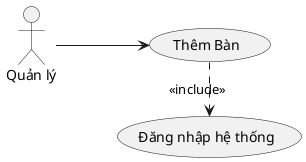

  -----------------------------------------------------------------------
  Thuộc tính                          Nội dung
  ----------------------------------- -----------------------------------
  **Use Case ID**                     UC07

  **Tên Use Case**                    Thêm Bàn

  **Actor**                           Quản lý

  **Mô tả**                           Thêm bàn mới vào hệ thống

  **Tiền điều kiện**                  Người dùng đã đăng nhập và đang ở
                                      trang Quản lý Bàn

  **Hậu điều kiện**                   Bàn mới được tạo và hiển thị trong danh sách

  **Luồng chính**                     1. Nhấn "Thêm bàn". 2. Nhập tên bàn, sức chứa. 3. Nhấn Xác nhận. 4. Hệ thống tạo bàn mới và cập nhật danh sách.

  **Luồng thay thế / Ngoại lệ**       \[A1\] Tên bàn trùng: Hiển thị lỗi trùng tên.

  **Quy tắc kinh doanh**              Tên bàn không để trống. Sức chứa
                                      tối thiểu 1 người.
  -----------------------------------------------------------------------

**UC08 -- Sửa Bàn**


  -----------------------------------------------------------------------
  Thuộc tính                          Nội dung
  ----------------------------------- -----------------------------------
  **Use Case ID**                     UC08

  **Tên Use Case**                    Sửa Bàn

  **Actor**                           Quản lý

  **Mô tả**                           Chỉnh sửa thông tin của bàn đã có

  **Tiền điều kiện**                  Người dùng đã đăng nhập và đang ở
                                      trang Quản lý Bàn

  **Hậu điều kiện**                   Thông tin bàn được cập nhật

  **Luồng chính**                     1. Chọn bàn cần sửa. 2. Thay đổi thông tin tên bàn, sức chứa. 3. Nhấn Xác nhận. 4. Hệ thống cập nhật thông tin bàn.

  **Luồng thay thế / Ngoại lệ**       \[A1\] Tên bàn trùng: Hiển thị lỗi trùng tên.

  **Quy tắc kinh doanh**              Tên bàn không để trống. Sức chứa
                                      tối thiểu 1 người.
  -----------------------------------------------------------------------

**UC09 -- Xóa Bàn**


  -----------------------------------------------------------------------
  Thuộc tính                          Nội dung
  ----------------------------------- -----------------------------------
  **Use Case ID**                     UC09

  **Tên Use Case**                    Xóa Bàn

  **Actor**                           Quản lý

  **Mô tả**                           Xóa bàn khỏi hệ thống

  **Tiền điều kiện**                  Người dùng đã đăng nhập và đang ở
                                      trang Quản lý Bàn

  **Hậu điều kiện**                   Bàn bị xóa khỏi hệ thống

  **Luồng chính**                     1. Chọn bàn cần xóa. 2. Nhấn Xóa và Xác nhận. 3. Hệ thống xóa bàn và cập nhật danh sách.

  **Luồng thay thế / Ngoại lệ**       \[A1\] Xóa bàn đang có
                                      khách: Từ chối, hiển thị "Không thể
                                      xóa bàn đang có đơn hàng".

  **Quy tắc kinh doanh**              Không xóa bàn đang OCCUPIED.
  -----------------------------------------------------------------------

**UC10 -- Tạo đơn hàng cho khách**

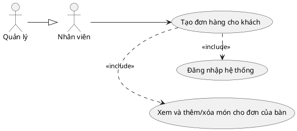

  -----------------------------------------------------------------------
  Thuộc tính                          Nội dung
  ----------------------------------- -----------------------------------
  **Use Case ID**                     UC10

  **Tên Use Case**                    Tạo đơn hàng cho khách

  **Actor**                           Nhân viên, Quản lý

  **Mô tả**                           Tạo đơn hàng mới cho khách, chọn
                                      hình thức phục vụ (dùng tại bàn
                                      hoặc mang về)

  **Tiền điều kiện**                  Nhân viên đã đăng nhập; nếu dùng
                                      tại bàn phải có bàn trống

  **Hậu điều kiện**                   Đơn hàng tạo với trạng thái
                                      PENDING, bàn (nếu có) chuyển sang
                                      OCCUPIED

  **Luồng chính**                     1\. Chọn hình thức: "Dùng tại bàn"
                                      hoặc "Mang về". 2. Nếu tại bàn:
                                      chọn bàn trống. 3. Hệ thống tạo đơn
                                      hàng. 4. Giao diện hiển thị đơn để
                                      thêm món (include UC11).

  **Luồng thay thế / Ngoại lệ**       \[A1\] Không có bàn trống: Cảnh
                                      báo, nhắc chọn Mang về.

  **Quy tắc kinh doanh**              Mỗi bàn chỉ có tối đa một đơn hàng
                                      đang mở cùng lúc.
  -----------------------------------------------------------------------

**UC11 -- Xem và thêm/xóa món cho đơn của bàn**

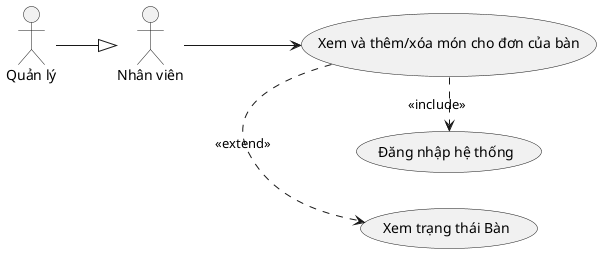

  -----------------------------------------------------------------------
  Thuộc tính                          Nội dung
  ----------------------------------- -----------------------------------
  **Use Case ID**                     UC11

  **Tên Use Case**                    Xem và thêm/xóa món cho đơn của bàn

  **Actor**                           Nhân viên, Quản lý

  **Mô tả**                           Xem chi tiết đơn hàng đang mở và
                                      thêm/xóa món ăn

  **Tiền điều kiện**                  Đơn hàng đã tạo (UC08) ở trạng thái
                                      PENDING hoặc PREPARING

  **Hậu điều kiện**                   Danh sách món trong đơn cập nhật,
                                      tổng tiền tính lại

  **Luồng chính**                     1\. Nhấn vào bàn đang có khách
                                      (extend từ UC06). 2. Hiển thị danh
                                      sách món hiện có. 3. Chọn món từ
                                      thực đơn và thêm vào đơn. 4. Cập
                                      nhật số lượng và tổng tiền. 5. Xóa
                                      món nếu cần.

  **Luồng thay thế / Ngoại lệ**       \[A1\] Đơn đã PAID: Không cho phép
                                      chỉnh sửa.

  **Quy tắc kinh doanh**              Chỉ sửa đơn ở trạng thái PENDING
                                      hoặc PREPARING. Số lượng mỗi món
                                      tối thiểu là 1.
  -----------------------------------------------------------------------

**UC12 -- Tạo hóa đơn cho khách**

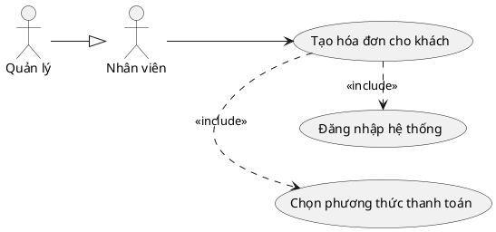

  -----------------------------------------------------------------------
  Thuộc tính                          Nội dung
  ----------------------------------- -----------------------------------
  **Use Case ID**                     UC12

  **Tên Use Case**                    Tạo hóa đơn cho khách

  **Actor**                           Nhân viên, Quản lý

  **Mô tả**                           Khởi tạo hóa đơn từ đơn hàng, tính
                                      tổng tiền và chuẩn bị thanh toán

  **Tiền điều kiện**                  Đơn hàng có ít nhất một món ở trạng
                                      thái PENDING/PREPARING

  **Hậu điều kiện**                   Hóa đơn tạo với trạng thái PENDING,
                                      sẵn sàng thanh toán

  **Luồng chính**                     1\. Nhấn "Thanh toán" trên đơn
                                      hàng. 2. Hệ thống tính tổng tiền.
                                      3. Hiển thị màn hình hóa đơn. 4.
                                      Xác nhận và chọn phương thức thanh
                                      toán (include UC13).

  **Luồng thay thế / Ngoại lệ**       \[A1\] Đơn không có món: Không cho
                                      phép tạo hóa đơn.

  **Quy tắc kinh doanh**              Tổng tiền = Tổng giá món × số lượng
                                      − Giảm giá voucher (nếu có).
  -----------------------------------------------------------------------

**UC13 -- Chọn phương thức thanh toán**

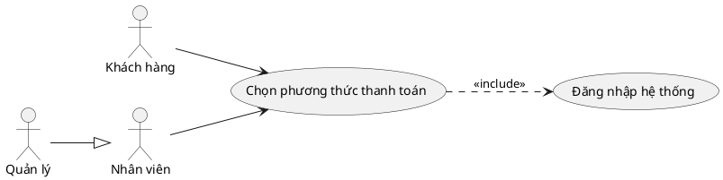

  -----------------------------------------------------------------------
  Thuộc tính                          Nội dung
  ----------------------------------- -----------------------------------
  **Use Case ID**                     UC13

  **Tên Use Case**                    Chọn phương thức thanh toán

  **Actor**                           Nhân viên, Khách hàng

  **Mô tả**                           Chọn hình thức thanh toán: Tiền
                                      mặt, MoMo, PayPal hoặc thẻ ngân
                                      hàng

  **Tiền điều kiện**                  Hóa đơn đã tạo (UC10) với tổng tiền
                                      xác định

  **Hậu điều kiện**                   Phương thức thanh toán được ghi
                                      nhận, hệ thống xử lý tương ứng

  **Luồng chính**                     1\. Màn hình hóa đơn hiển thị các
                                      phương thức. 2. Chọn phương thức
                                      thanh toán. 3. Nếu tiền mặt: nhập
                                      số tiền nhận → tính tiền thối. 4.
                                      Nếu online: chuyển sang cổng thanh
                                      toán tương ứng.

  **Luồng thay thế / Ngoại lệ**       \[A1\] Giao dịch online thất bại:
                                      Thông báo lỗi, cho phép chọn lại.

  **Quy tắc kinh doanh**              Số tiền thanh toán phải \>= tổng
                                      hóa đơn sau giảm giá.
  -----------------------------------------------------------------------

**UC14 -- Nhập Voucher của khách và áp dụng**

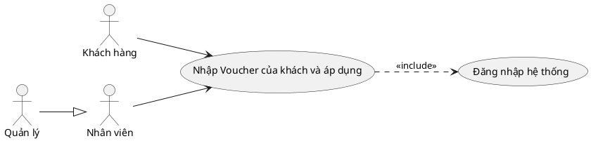

  -----------------------------------------------------------------------
  Thuộc tính                          Nội dung
  ----------------------------------- -----------------------------------
  **Use Case ID**                     UC14

  **Tên Use Case**                    Nhập Voucher của khách và áp dụng

  **Actor**                           Nhân viên, Khách hàng

  **Mô tả**                           Nhập mã voucher vào hóa đơn để được
                                      giảm giá tương ứng

  **Tiền điều kiện**                  Hóa đơn đang PENDING; khách có mã
                                      voucher hợp lệ

  **Hậu điều kiện**                   Hóa đơn cập nhật với khoản giảm giá
                                      từ voucher

  **Luồng chính**                     1\. Nhập mã voucher vào ô tương
                                      ứng. 2. Hệ thống kiểm tra tính hợp
                                      lệ. 3. Hiển thị số tiền được giảm.
                                      4. Tổng tiền được cập nhật lại.

  **Luồng thay thế / Ngoại lệ**       \[A1\] Voucher không hợp lệ/hết
                                      hạn: Hiển thị thông báo lỗi. \[A2\]
                                      Đơn chưa đủ điều kiện tối thiểu:
                                      Hiển thị cảnh báo.

  **Quy tắc kinh doanh**              Voucher phải còn hiệu lực và chưa
                                      sử dụng. Tổng đơn \>=
                                      `minOrderAmount` của voucher.
  -----------------------------------------------------------------------

**UC15 -- Nhập số điện thoại tích điểm**

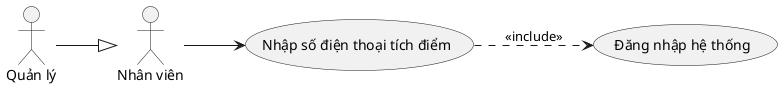

  -----------------------------------------------------------------------
  Thuộc tính                          Nội dung
  ----------------------------------- -----------------------------------
  **Use Case ID**                     UC15

  **Tên Use Case**                    Nhập số điện thoại tích điểm

  **Actor**                           Nhân viên

  **Mô tả**                           Nhập số điện thoại khách để tích
                                      điểm thưởng sau khi thanh toán
                                      thành công

  **Tiền điều kiện**                  Hóa đơn đang được xử lý thanh toán

  **Hậu điều kiện**                   Điểm thưởng được cộng vào tài khoản
                                      khách hàng tương ứng

  **Luồng chính**                     1\. Nhân viên nhập số điện thoại
                                      khách. 2. Hệ thống tìm tài khoản
                                      khách hàng. 3. Sau thanh toán thành
                                      công, cộng điểm tương ứng với giá
                                      trị hóa đơn.

  **Luồng thay thế / Ngoại lệ**       \[A1\] Số điện thoại không tồn tại:
                                      Bỏ qua tích điểm, tiếp tục thanh
                                      toán.

  **Quy tắc kinh doanh**              Điểm tích lũy = giá trị hóa đơn /
                                      10.000 (làm tròn xuống).
  -----------------------------------------------------------------------

**UC16 -- Xuất Hóa đơn**

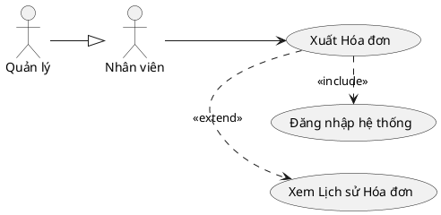

  -----------------------------------------------------------------------
  Thuộc tính                          Nội dung
  ----------------------------------- -----------------------------------
  **Use Case ID**                     UC16

  **Tên Use Case**                    Xuất Hóa đơn

  **Actor**                           Nhân viên, Quản lý

  **Mô tả**                           Xuất file hóa đơn dạng Word để in
                                      hoặc lưu

  **Tiền điều kiện**                  Hóa đơn đã thanh toán thành công
                                      (trạng thái PAID)

  **Hậu điều kiện**                   File hóa đơn được tải xuống thiết
                                      bị người dùng

  **Luồng chính**                     1\. Nhấn nút "Xuất hóa đơn". 2. Hệ
                                      thống gọi API tạo file Word. 3.
                                      Trình duyệt tự động tải file về.

  **Luồng thay thế / Ngoại lệ**       \[A1\] Hóa đơn chưa thanh toán: Nút
                                      xuất bị vô hiệu hóa.

  **Quy tắc kinh doanh**              Chỉ xuất được hóa đơn có trạng thái
                                      PAID.
  -----------------------------------------------------------------------

**UC17 -- Xem Lịch sử Hóa đơn**

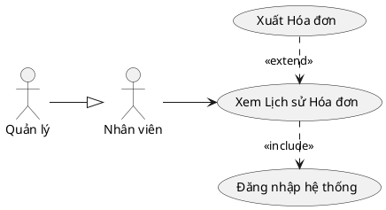

  -----------------------------------------------------------------------
  Thuộc tính                          Nội dung
  ----------------------------------- -----------------------------------
  **Use Case ID**                     UC17

  **Tên Use Case**                    Xem Lịch sử Hóa đơn

  **Actor**                           Nhân viên, Quản lý

  **Mô tả**                           Xem danh sách hóa đơn đã phát sinh,
                                      có thể lọc theo ngày và trạng thái

  **Tiền điều kiện**                  Người dùng đã đăng nhập

  **Hậu điều kiện**                   Danh sách hóa đơn theo điều kiện
                                      lọc được hiển thị

  **Luồng chính**                     1\. Truy cập trang "Lịch sử Hóa
                                      đơn". 2. Hệ thống tải danh sách gần
                                      nhất. 3. Nhập bộ lọc (ngày bắt đầu,
                                      kết thúc, trạng thái). 4. Cập nhật
                                      bảng theo điều kiện lọc. 5. Nhấn
                                      vào hóa đơn để xem chi tiết hoặc
                                      xuất file (extend UC16).

  **Luồng thay thế / Ngoại lệ**       \[A1\] Không có kết quả: Hiển thị
                                      "Không có dữ liệu".

  **Quy tắc kinh doanh**              Nhân viên chỉ xem hóa đơn của ca
                                      mình. Quản lý xem được toàn bộ hóa
                                      đơn.
  -----------------------------------------------------------------------

#### 3.2.4. Use Case Chi tiết - Quản lý Hệ thống {#use-case-chi-tiết---quản-lý-hệ-thống .unnumbered}

**UC18 -- Thêm Voucher**

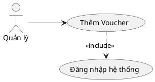

  -----------------------------------------------------------------------
  Thuộc tính                          Nội dung
  ----------------------------------- -----------------------------------
  **Use Case ID**                     UC18

  **Tên Use Case**                    Thêm Voucher

  **Actor**                           Quản lý

  **Mô tả**                           Tạo voucher giảm giá mới trong hệ thống

  **Tiền điều kiện**                  Quản lý đã đăng nhập và truy cập
                                      trang Quản lý Voucher

  **Hậu điều kiện**                   Voucher mới được tạo và hiển thị trong danh sách

  **Luồng chính**                     1. Nhấn "Tạo voucher". 2. Nhập mã, loại, giá trị giảm, điều kiện. 3. Nhấn Xác nhận. 4. Hệ thống tạo voucher mới.

  **Luồng thay thế / Ngoại lệ**       \[A1\] Mã voucher trùng: Hiển thị lỗi mã voucher đã tồn tại.

  **Quy tắc kinh doanh**              Mã voucher phải duy nhất. Giá trị giảm phải \> 0.
  -----------------------------------------------------------------------

**UC19 -- Sửa Voucher**


  -----------------------------------------------------------------------
  Thuộc tính                          Nội dung
  ----------------------------------- -----------------------------------
  **Use Case ID**                     UC19

  **Tên Use Case**                    Sửa Voucher

  **Actor**                           Quản lý

  **Mô tả**                           Chỉnh sửa thông tin voucher đã có

  **Tiền điều kiện**                  Quản lý đã đăng nhập và truy cập
                                      trang Quản lý Voucher

  **Hậu điều kiện**                   Thông tin voucher được cập nhật

  **Luồng chính**                     1. Chọn voucher cần sửa. 2. Thay đổi thông tin loại, giá trị giảm, điều kiện. 3. Nhấn Lưu. 4. Hệ thống cập nhật thông tin voucher.

  **Luồng thay thế / Ngoại lệ**       \[A1\] Dữ liệu không hợp lệ: Hiển thị thông báo lỗi.

  **Quy tắc kinh doanh**              Giá trị giảm phải \> 0.
  -----------------------------------------------------------------------

**UC20 -- Xóa Voucher**


  -----------------------------------------------------------------------
  Thuộc tính                          Nội dung
  ----------------------------------- -----------------------------------
  **Use Case ID**                     UC20

  **Tên Use Case**                    Xóa Voucher

  **Actor**                           Quản lý

  **Mô tả**                           Xóa voucher khỏi hệ thống

  **Tiền điều kiện**                  Quản lý đã đăng nhập và truy cập
                                      trang Quản lý Voucher

  **Hậu điều kiện**                   Voucher bị xóa khỏi hệ thống

  **Luồng chính**                     1. Chọn voucher cần xóa. 2. Nhấn Xóa và Xác nhận. 3. Hệ thống xóa voucher và cập nhật danh sách.

  **Luồng thay thế / Ngoại lệ**       \[A1\] Xóa voucher đang sử
                                      dụng: Từ chối, hiển thị cảnh báo "Không thể xóa voucher đang sử dụng".

  **Quy tắc kinh doanh**              Voucher đang được dùng không thể xóa.
  -----------------------------------------------------------------------

**UC21 -- Thêm Danh mục**

```plantuml
@startuml
skinparam defaultFontName "Arial"
left to right direction
actor "Quản lý" as QL

usecase "Thêm Danh mục" as UC21
usecase "Đăng nhập hệ thống" as UC01

QL --> UC21
UC21 .> UC01 : <<include>>
@enduml
```

  -----------------------------------------------------------------------
  Thuộc tính                          Nội dung
  ----------------------------------- -----------------------------------
  **Use Case ID**                     UC21

  **Tên Use Case**                    Thêm Danh mục

  **Actor**                           Quản lý

  **Mô tả**                           Thêm danh mục phân loại món ăn mới

  **Tiền điều kiện**                  Quản lý đã đăng nhập và truy cập
                                      trang Quản lý Danh mục

  **Hậu điều kiện**                   Danh mục mới được tạo và hiển thị

  **Luồng chính**                     1. Nhấn nút thêm danh mục. 2. Nhập tên danh mục. 3. Nhấn Xác nhận. 4. Hệ thống tạo danh mục mới.

  **Luồng thay thế / Ngoại lệ**       \[A1\] Tên danh mục trùng: Hiển thị lỗi danh mục đã tồn tại.

  **Quy tắc kinh doanh**              Tên danh mục không để trống và phải duy nhất.
  -----------------------------------------------------------------------

**UC22 -- Sửa Danh mục**

```plantuml
@startuml
skinparam defaultFontName "Arial"
left to right direction
actor "Quản lý" as QL

usecase "Sửa Danh mục" as UC22
usecase "Đăng nhập hệ thống" as UC01

QL --> UC22
UC22 .> UC01 : <<include>>
@enduml
```

  -----------------------------------------------------------------------
  Thuộc tính                          Nội dung
  ----------------------------------- -----------------------------------
  **Use Case ID**                     UC22

  **Tên Use Case**                    Sửa Danh mục

  **Actor**                           Quản lý

  **Mô tả**                           Chỉnh sửa tên danh mục đã có

  **Tiền điều kiện**                  Quản lý đã đăng nhập và truy cập
                                      trang Quản lý Danh mục

  **Hậu điều kiện**                   Tên danh mục được cập nhật

  **Luồng chính**                     1. Chọn danh mục cần sửa. 2. Nhập tên mới. 3. Nhấn Lưu. 4. Hệ thống cập nhật tên danh mục.

  **Luồng thay thế / Ngoại lệ**       \[A1\] Tên danh mục trùng: Hiển thị lỗi danh mục đã tồn tại.

  **Quy tắc kinh doanh**              Tên danh mục không để trống và phải duy nhất.
  -----------------------------------------------------------------------

**UC23 -- Xóa Danh mục**

```plantuml
@startuml
skinparam defaultFontName "Arial"
left to right direction
actor "Quản lý" as QL

usecase "Xóa Danh mục" as UC23
usecase "Đăng nhập hệ thống" as UC01

QL --> UC23
UC23 .> UC01 : <<include>>
@enduml
```

  -----------------------------------------------------------------------
  Thuộc tính                          Nội dung
  ----------------------------------- -----------------------------------
  **Use Case ID**                     UC23

  **Tên Use Case**                    Xóa Danh mục

  **Actor**                           Quản lý

  **Mô tả**                           Xóa danh mục khỏi hệ thống

  **Tiền điều kiện**                  Quản lý đã đăng nhập và truy cập
                                      trang Quản lý Danh mục

  **Hậu điều kiện**                   Danh mục bị xóa khỏi hệ thống

  **Luồng chính**                     1. Chọn danh mục cần xóa. 2. Nhấn Xóa và Xác nhận. 3. Hệ thống xóa danh mục và cập nhật danh sách.

  **Luồng thay thế / Ngoại lệ**       \[A1\] Xóa danh mục còn món
                                      ăn: Từ chối, hiển thị "Không thể
                                      xóa khi còn món ăn".

  **Quy tắc kinh doanh**              Không xóa danh mục đang có món ăn.
  -----------------------------------------------------------------------

**UC24 -- Thêm Món ăn**

```plantuml
@startuml
skinparam defaultFontName "Arial"
left to right direction
actor "Quản lý" as QL

usecase "Thêm Món ăn" as UC24
usecase "Đăng nhập hệ thống" as UC01

QL --> UC24
UC24 .> UC01 : <<include>>
@enduml
```

  -----------------------------------------------------------------------
  Thuộc tính                          Nội dung
  ----------------------------------- -----------------------------------
  **Use Case ID**                     UC24

  **Tên Use Case**                    Thêm Món ăn

  **Actor**                           Quản lý

  **Mô tả**                           Thêm món ăn mới vào thực đơn

  **Tiền điều kiện**                  Quản lý đã đăng nhập và truy cập
                                      trang Quản lý Thực đơn

  **Hậu điều kiện**                   Món ăn mới được tạo và hiển thị trong thực đơn

  **Luồng chính**                     1. Nhấn "Thêm món". 2. Nhập tên, giá, hình ảnh, chọn danh mục. 3. Nhấn Xác nhận. 4. Hệ thống tạo món ăn mới.

  **Luồng thay thế / Ngoại lệ**       \[A1\] Giá tiền không hợp lệ: Hiển thị lỗi validation. \[A2\] Chưa chọn danh mục: Hiển thị lỗi bắt buộc.

  **Quy tắc kinh doanh**              Tên món không để trống. Giá phải \> 0. Mỗi món phải thuộc ít nhất một danh mục.
  -----------------------------------------------------------------------

**UC25 -- Sửa Món ăn**

```plantuml
@startuml
skinparam defaultFontName "Arial"
left to right direction
actor "Quản lý" as QL

usecase "Sửa Món ăn" as UC25
usecase "Đăng nhập hệ thống" as UC01

QL --> UC25
UC25 .> UC01 : <<include>>
@enduml
```

  -----------------------------------------------------------------------
  Thuộc tính                          Nội dung
  ----------------------------------- -----------------------------------
  **Use Case ID**                     UC25

  **Tên Use Case**                    Sửa Món ăn

  **Actor**                           Quản lý

  **Mô tả**                           Cập nhật thông tin món ăn đã có

  **Tiền điều kiện**                  Quản lý đã đăng nhập và truy cập
                                      trang Quản lý Thực đơn

  **Hậu điều kiện**                   Thông tin món ăn được cập nhật

  **Luồng chính**                     1. Chọn món ăn cần sửa. 2. Thay đổi thông tin tên, giá, hình ảnh, danh mục. 3. Nhấn Lưu. 4. Hệ thống cập nhật thông tin món.

  **Luồng thay thế / Ngoại lệ**       \[A1\] Giá tiền không hợp lệ: Hiển thị lỗi validation. \[A2\] Chưa chọn danh mục: Hiển thị lỗi bắt buộc.

  **Quy tắc kinh doanh**              Tên món không để trống. Giá phải \> 0. Mỗi món phải thuộc ít nhất một danh mục.
  -----------------------------------------------------------------------

**UC26 -- Xóa Món ăn**

```plantuml
@startuml
skinparam defaultFontName "Arial"
left to right direction
actor "Quản lý" as QL

usecase "Xóa Món ăn" as UC26
usecase "Đăng nhập hệ thống" as UC01

QL --> UC26
UC26 .> UC01 : <<include>>
@enduml
```

  -----------------------------------------------------------------------
  Thuộc tính                          Nội dung
  ----------------------------------- -----------------------------------
  **Use Case ID**                     UC26

  **Tên Use Case**                    Xóa Món ăn

  **Actor**                           Quản lý

  **Mô tả**                           Xóa món ăn khỏi thực đơn

  **Tiền điều kiện**                  Quản lý đã đăng nhập và truy cập
                                      trang Quản lý Thực đơn

  **Hậu điều kiện**                   Món ăn bị xóa khỏi hệ thống

  **Luồng chính**                     1. Chọn món ăn cần xóa. 2. Nhấn Xóa và Xác nhận. 3. Hệ thống xóa món ăn và cập nhật danh sách.

  **Luồng thay thế / Ngoại lệ**       \[A1\] Món ăn đang nằm trong đơn hàng chờ xử lý: Từ chối xóa.

  **Quy tắc kinh doanh**              Không thể xóa món ăn đang có trong các đơn hàng chưa thanh toán.
  -----------------------------------------------------------------------

**UC27 -- Thêm Người Dùng**

```plantuml
@startuml
skinparam defaultFontName "Arial"
left to right direction
actor "Quản lý" as QL

usecase "Thêm Người Dùng" as UC27
usecase "Đăng nhập hệ thống" as UC01

QL --> UC27
UC27 .> UC01 : <<include>>
@enduml
```

  -----------------------------------------------------------------------
  Thuộc tính                          Nội dung
  ----------------------------------- -----------------------------------
  **Use Case ID**                     UC27

  **Tên Use Case**                    Thêm Người Dùng

  **Actor**                           Quản lý

  **Mô tả**                           Thêm tài khoản nhân viên mới vào hệ thống

  **Tiền điều kiện**                  Quản lý đã đăng nhập và truy cập
                                      trang Quản lý Người Dùng

  **Hậu điều kiện**                   Tài khoản nhân viên mới được tạo

  **Luồng chính**                     1. Nhấn nút thêm người dùng. 2. Nhập tên, email, vai trò (role). 3. Nhấn Xác nhận. 4. Hệ thống tạo tài khoản nhân viên.

  **Luồng thay thế / Ngoại lệ**       \[A1\] Email đã tồn tại: Hiển thị lỗi trùng email.

  **Quy tắc kinh doanh**              Email phải duy nhất. Vai trò
                                      chỉ gồm ADMIN hoặc STAFF.
  -----------------------------------------------------------------------

**UC28 -- Sửa Người Dùng**

```plantuml
@startuml
skinparam defaultFontName "Arial"
left to right direction
actor "Quản lý" as QL

usecase "Sửa Người Dùng" as UC28
usecase "Đăng nhập hệ thống" as UC01

QL --> UC28
UC28 .> UC01 : <<include>>
@enduml
```

  -----------------------------------------------------------------------
  Thuộc tính                          Nội dung
  ----------------------------------- -----------------------------------
  **Use Case ID**                     UC28

  **Tên Use Case**                    Sửa Người Dùng

  **Actor**                           Quản lý

  **Mô tả**                           Chỉnh sửa thông tin tài khoản của nhân viên

  **Tiền điều kiện**                  Quản lý đã đăng nhập và truy cập
                                      trang Quản lý Người Dùng

  **Hậu điều kiện**                   Thông tin người dùng được cập nhật

  **Luồng chính**                     1. Chọn người dùng cần sửa. 2. Thay đổi thông tin tên, vai trò. 3. Nhấn Lưu. 4. Hệ thống cập nhật thông tin.

  **Luồng thay thế / Ngoại lệ**       \[A1\] Dữ liệu không hợp lệ: Hiển thị thông báo lỗi.

  **Quy tắc kinh doanh**              Vai trò chỉ gồm ADMIN hoặc STAFF.
  -----------------------------------------------------------------------

**UC29 -- Vô hiệu hóa Người Dùng**

```plantuml
@startuml
skinparam defaultFontName "Arial"
left to right direction
actor "Quản lý" as QL

usecase "Vô hiệu hóa Người Dùng" as UC29
usecase "Đăng nhập hệ thống" as UC01

QL --> UC29
UC29 .> UC01 : <<include>>
@enduml
```

  -----------------------------------------------------------------------
  Thuộc tính                          Nội dung
  ----------------------------------- -----------------------------------
  **Use Case ID**                     UC29

  **Tên Use Case**                    Vô hiệu hóa Người Dùng

  **Actor**                           Quản lý

  **Mô tả**                           Vô hiệu hóa tài khoản của người dùng (xóa mềm)

  **Tiền điều kiện**                  Quản lý đã đăng nhập và truy cập
                                      trang Quản lý Người Dùng

  **Hậu điều kiện**                   Tài khoản người dùng bị vô hiệu hóa

  **Luồng chính**                     1. Chọn người dùng cần vô hiệu hóa. 2. Nhấn Xóa/Khóa và Xác nhận. 3. Hệ thống chuyển trạng thái tài khoản thành vô hiệu hóa.

  **Luồng thay thế / Ngoại lệ**       \[A1\] Tự vô hiệu hóa tài khoản
                                      mình: Hệ thống từ chối.

  **Quy tắc kinh doanh**              Không thể xóa/vô hiệu hóa tài khoản đang đăng nhập.
  -----------------------------------------------------------------------

**UC30 -- Quản lý Đơn hàng**

```plantuml
@startuml
skinparam defaultFontName "Arial"
left to right direction
actor "Quản lý" as QL

usecase "Quản lý Đơn hàng" as UC30
usecase "Đăng nhập hệ thống" as UC01

QL --> UC30
UC30 .> UC01 : <<include>>
@enduml
```

  -----------------------------------------------------------------------
  Thuộc tính                          Nội dung
  ----------------------------------- -----------------------------------
  **Use Case ID**                     UC30

  **Tên Use Case**                    Quản lý Đơn hàng

  **Actor**                           Quản lý

  **Mô tả**                           Xem, cập nhật trạng thái hoặc hủy
                                      đơn hàng trong hệ thống

  **Tiền điều kiện**                  Quản lý đã đăng nhập và truy cập
                                      trang Quản lý Đơn hàng

  **Hậu điều kiện**                   Trạng thái đơn hàng được cập nhật
                                      theo thao tác

  **Luồng chính**                     1\. Xem danh sách đơn hàng. 2. Lọc
                                      theo trạng thái/ngày. 3. Chọn đơn
                                      để xem chi tiết. 4. Cập nhật trạng
                                      thái hoặc hủy đơn.

  **Luồng thay thế / Ngoại lệ**       \[A1\] Hủy đơn đã PAID: Hệ thống từ
                                      chối, yêu cầu hoàn tiền.

  **Quy tắc kinh doanh**              Chỉ hủy đơn ở trạng thái PENDING
                                      hoặc PREPARING. Đơn PAID không thể
                                      hủy.
  -----------------------------------------------------------------------

**UC31 -- Xem Dashboard Thống kê**

```plantuml
@startuml
skinparam defaultFontName "Arial"
left to right direction
actor "Quản lý" as QL

usecase "Xem Dashboard Thống kê" as UC31
usecase "Xem Doanh thu Chi tiết" as UC32
usecase "Đăng nhập hệ thống" as UC01

QL --> UC31
UC32 .> UC31 : <<extend>>
UC31 .> UC01 : <<include>>
@enduml
```

  -----------------------------------------------------------------------
  Thuộc tính                          Nội dung
  ----------------------------------- -----------------------------------
  **Use Case ID**                     UC31

  **Tên Use Case**                    Xem Dashboard Thống kê

  **Actor**                           Quản lý

  **Mô tả**                           Xem tổng quan các chỉ số kinh
                                      doanh: doanh thu, số đơn, số người
                                      dùng, món bán chạy

  **Tiền điều kiện**                  Quản lý đã đăng nhập

  **Hậu điều kiện**                   Dashboard hiển thị các biểu đồ và
                                      số liệu thống kê

  **Luồng chính**                     1\. Truy cập trang Dashboard. 2. Hệ
                                      thống gọi API lấy số liệu tổng
                                      quan. 3. Hiển thị biểu đồ doanh
                                      thu, top món bán chạy, số đơn hàng.
                                      4. Nhấn "Xem chi tiết" để xem Doanh
                                      thu Chi tiết (extend UC32).

  **Luồng thay thế / Ngoại lệ**       \[A1\] Không có dữ liệu: Hiển thị
                                      biểu đồ trống với thông báo.

  **Quy tắc kinh doanh**              Dữ liệu thống kê được cập nhật theo
                                      thời gian thực.
  -----------------------------------------------------------------------

**UC32 -- Xem Doanh thu Chi tiết**

```plantuml
@startuml
skinparam defaultFontName "Arial"
left to right direction
actor "Quản lý" as QL

usecase "Xem Doanh thu Chi tiết" as UC32
usecase "Xem Dashboard Thống kê" as UC31
usecase "Đăng nhập hệ thống" as UC01

QL --> UC32
UC32 .> UC31 : <<extend>>
UC32 .> UC01 : <<include>>
@enduml
```

  -----------------------------------------------------------------------
  Thuộc tính                          Nội dung
  ----------------------------------- -----------------------------------
  **Use Case ID**                     UC32

  **Tên Use Case**                    Xem Doanh thu Chi tiết

  **Actor**                           Quản lý

  **Mô tả**                           Xem báo cáo doanh thu theo
                                      ngày/tháng và phân tích theo phương
                                      thức thanh toán

  **Tiền điều kiện**                  Quản lý đã đăng nhập và đang xem
                                      Dashboard (UC31)

  **Hậu điều kiện**                   Báo cáo doanh thu chi tiết được
                                      hiển thị dưới dạng biểu đồ

  **Luồng chính**                     1\. Nhấn "Doanh thu Chi tiết" từ
                                      Dashboard. 2. Chọn tháng/năm cần
                                      xem. 3. Hệ thống hiển thị biểu đồ
                                      doanh thu theo ngày. 4. Xem tỷ lệ
                                      phân bổ phương thức thanh toán. 5.
                                      Xem top món bán chạy.

  **Luồng thay thế / Ngoại lệ**       \[A1\] Không có dữ liệu tháng được
                                      chọn: Hiển thị biểu đồ trống.

  **Quy tắc kinh doanh**              Chỉ tính doanh thu từ hóa đơn có
                                      trạng thái PAID.
  -----------------------------------------------------------------------

**UC33 -- AI Gợi ý Trend**

```plantuml
@startuml
skinparam defaultFontName "Arial"
left to right direction
actor "Quản lý" as QL

usecase "AI Gợi ý Trend" as UC33
usecase "Đăng nhập hệ thống" as UC01

QL --> UC33
UC33 .> UC01 : <<include>>
@enduml
```

  -----------------------------------------------------------------------
  Thuộc tính                          Nội dung
  ----------------------------------- -----------------------------------
  **Use Case ID**                     UC33

  **Tên Use Case**                    AI Gợi ý Trend

  **Actor**                           Quản lý

  **Mô tả**                           Kích hoạt AI phân tích xu hướng món
                                      ăn từ mạng xã hội và Google Trends,
                                      gợi ý bổ sung thực đơn

  **Tiền điều kiện**                  Quản lý đã đăng nhập và truy cập
                                      trang AI Gợi ý Trend

  **Hậu điều kiện**                   Danh sách món ăn xu hướng được hiển
                                      thị, quản lý có thể thêm vào thực
                                      đơn

  **Luồng chính**                     1\. Nhấn "Phân tích xu hướng". 2.
                                      Hệ thống gọi SerpAPI/Instagram lấy
                                      dữ liệu. 3. Chuyển dữ liệu cho AI
                                      (Llama) phân tích. 4. Hiển thị danh
                                      sách món trending. 5. Quản lý chọn
                                      món muốn thêm vào thực đơn (UC24).

  **Luồng thay thế / Ngoại lệ**       \[A1\] API bên ngoài lỗi: Hiển thị
                                      "Không thể kết nối dịch vụ phân
                                      tích".

  **Quy tắc kinh doanh**              Kết quả phân tích được lưu vào
                                      database để xem lại lịch sử.
  -----------------------------------------------------------------------

#### 3.2.5. Use Case Chi tiết - Khách hàng {#use-case-chi-tiết---khách-hàng .unnumbered}

**UC34 -- Xem Thực đơn**

```plantuml
@startuml
skinparam defaultFontName "Arial"
left to right direction
actor "Khách hàng" as KH

usecase "Xem Thực đơn" as UC34
usecase "Đăng nhập hệ thống" as UC01

KH --> UC34
UC34 ..> UC01 : <<include>>
@enduml
```

  -----------------------------------------------------------------------
  Thuộc tính                          Nội dung
  ----------------------------------- -----------------------------------
  **Use Case ID**                     UC34

  **Tên Use Case**                    Xem Thực đơn

  **Actor**                           Khách hàng

  **Mô tả**                           Khách hàng xem danh sách các món ăn
                                      và đồ uống có sẵn trong thực đơn
                                      của quán

  **Tiền điều kiện**                  Khách hàng đã truy cập website

  **Hậu điều kiện**                   Danh sách món ăn được hiển thị theo
                                      danh mục

  **Luồng chính**                     1\. Khách hàng truy cập trang thực
                                      đơn. 2. Hệ thống hiển thị danh sách
                                      món theo danh mục. 3. Khách hàng có
                                      thể lọc theo danh mục hoặc tìm kiếm
                                      theo tên món.

  **Luồng thay thế / Ngoại lệ**       \[A1\] Chưa có món nào: Hiển thị
                                      thông báo "Thực đơn đang được cập
                                      nhật".

  **Quy tắc kinh doanh**              Chỉ hiển thị các món ăn đang hoạt
                                      động (active).
  -----------------------------------------------------------------------

**UC35 -- Đổi Điểm lấy Voucher**

```plantuml
@startuml
skinparam defaultFontName "Arial"
left to right direction
actor "Khách hàng" as KH

usecase "Đổi Điểm lấy Voucher" as UC35
usecase "Đăng nhập hệ thống" as UC01

KH --> UC35
UC35 ..> UC01 : <<include>>
@enduml
```

  -----------------------------------------------------------------------
  Thuộc tính                          Nội dung
  ----------------------------------- -----------------------------------
  **Use Case ID**                     UC35

  **Tên Use Case**                    Đổi Điểm lấy Voucher

  **Actor**                           Khách hàng

  **Mô tả**                           Khách hàng sử dụng điểm tích lũy để
                                      đổi lấy mã voucher giảm giá

  **Tiền điều kiện**                  Khách hàng đã đăng nhập và có đủ
                                      điểm tích lũy

  **Hậu điều kiện**                   Điểm bị trừ, mã voucher mới được
                                      tạo cho khách hàng

  **Luồng chính**                     1\. Khách hàng vào trang đổi điểm.
                                      2. Hệ thống hiển thị điểm hiện có
                                      và danh sách voucher có thể đổi. 3.
                                      Chọn voucher muốn đổi. 4. Hệ thống
                                      kiểm tra điểm đủ điều kiện. 5. Xác
                                      nhận đổi điểm. 6. Hệ thống trừ điểm
                                      và cấp mã voucher.

  **Luồng thay thế / Ngoại lệ**       \[A1\] Không đủ điểm: Thông báo
                                      "Điểm tích lũy không đủ".

  **Quy tắc kinh doanh**              Điểm tích lũy phải \>=
                                      `requiredPoints` của voucher. Mỗi
                                      lần đổi tạo một mã voucher riêng
                                      biệt.
  -----------------------------------------------------------------------

**UC36 -- Quản lý Voucher Cá nhân**

```plantuml
@startuml
skinparam defaultFontName "Arial"
left to right direction
actor "Khách hàng" as KH

usecase "Quản lý Voucher Cá nhân" as UC36
usecase "Đăng nhập hệ thống" as UC01

KH --> UC36
UC36 ..> UC01 : <<include>>
@enduml
```

  -----------------------------------------------------------------------
  Thuộc tính                          Nội dung
  ----------------------------------- -----------------------------------
  **Use Case ID**                     UC36

  **Tên Use Case**                    Quản lý Voucher Cá nhân

  **Actor**                           Khách hàng

  **Mô tả**                           Khách hàng xem danh sách voucher
                                      đang sở hữu và trạng thái sử dụng

  **Tiền điều kiện**                  Khách hàng đã đăng nhập

  **Hậu điều kiện**                   Danh sách voucher cá nhân được hiển
                                      thị

  **Luồng chính**                     1\. Khách hàng vào trang "Voucher
                                      của tôi". 2. Hệ thống hiển thị danh
                                      sách voucher kèm trạng thái (còn
                                      hạn / đã dùng / hết hạn). 3. Khách
                                      hàng có thể copy mã voucher để dùng
                                      khi thanh toán.

  **Luồng thay thế / Ngoại lệ**       \[A1\] Chưa có voucher: Hiển thị
                                      "Bạn chưa có voucher nào".

  **Quy tắc kinh doanh**              Voucher hết hạn tự động chuyển
                                      trạng thái EXPIRED. Voucher đã dùng
                                      không thể dùng lại.
  -----------------------------------------------------------------------

**UC37 -- Gửi Đề xuất Món ăn**

```plantuml
@startuml
skinparam defaultFontName "Arial"
left to right direction
actor "Khách hàng" as KH

usecase "Gửi Đề xuất Món ăn" as UC37

KH --> UC37
@enduml
```

  -----------------------------------------------------------------------
  Thuộc tính                          Nội dung
  ----------------------------------- -----------------------------------
  **Use Case ID**                     UC37

  **Tên Use Case**                    Gửi Đề xuất Món ăn

  **Actor**                           Khách hàng

  **Mô tả**                           Khách hàng đề xuất món ăn mới hoặc
                                      bình chọn cho các đề xuất hiện có
                                      để góp ý cho thực đơn

  **Tiền điều kiện**                  Khách hàng đã đăng nhập

  **Hậu điều kiện**                   Đề xuất món ăn được lưu vào hệ
                                      thống, quản lý có thể xem xét

  **Luồng chính**                     1\. Khách hàng truy cập trang đề
                                      xuất món ăn. 2. Nhập tên món, mô
                                      tả, danh mục. 3. Gửi đề xuất. 4. Hệ
                                      thống lưu đề xuất và thông báo
                                      thành công.

  **Luồng thay thế / Ngoại lệ**       \[A1\] Tên món để trống: Hiển thị
                                      lỗi validation.

  **Quy tắc kinh doanh**              Tên món không để trống. Mỗi tài
                                      khoản có thể gửi nhiều đề xuất.
  -----------------------------------------------------------------------

**UC38 -- Gửi Liên hệ**

```plantuml
@startuml
skinparam defaultFontName "Arial"
left to right direction
actor "Khách hàng" as KH

usecase "Gửi Liên hệ" as UC38

KH --> UC38
@enduml
```

  -----------------------------------------------------------------------
  Thuộc tính                          Nội dung
  ----------------------------------- -----------------------------------
  **Use Case ID**                     UC38

  **Tên Use Case**                    Gửi Liên hệ

  **Actor**                           Khách hàng

  **Mô tả**                           Khách hàng gửi thông tin liên hệ,
                                      góp ý hoặc phản hồi đến quản lý
                                      quán

  **Tiền điều kiện**                  Khách hàng đã truy cập website

  **Hậu điều kiện**                   Thông tin liên hệ được gửi đến hệ
                                      thống và quản lý nhận được thông
                                      báo

  **Luồng chính**                     1\. Khách hàng truy cập trang Liên
                                      hệ. 2. Điền tên, email, nội dung.
                                      3. Nhấn "Gửi". 4. Hệ thống lưu
                                      thông tin và gửi email xác nhận cho
                                      khách hàng.

  **Luồng thay thế / Ngoại lệ**       \[A1\] Email không đúng định dạng:
                                      Hiển thị lỗi. \[A2\] Nội dung để
                                      trống: Hiển thị lỗi bắt buộc.

  **Quy tắc kinh doanh**              Email phải đúng định dạng. Nội dung
                                      liên hệ tối thiểu 10 ký tự.
  -----------------------------------------------------------------------

###  {#section-2 .unnumbered}

###    {#section-3 .unnumbered}

### 3.3. Sơ đồ Lớp (Class Diagram) {#sơ-đồ-lớp-class-diagram .unnumbered}

{width="7.132638888888889in" height="4.480555555555555in"}

Dưới đây là sơ đồ lớp chi tiết bao gồm các thuộc tính và phương thức (dựa trên cấu trúc Entity thực tế của dự án):

```plantuml
@startuml
skinparam classAttributeIconSize 0
skinparam linetype orthogonal
skinparam shadow false

skinparam class {
    BackgroundColor White
    HeaderBackgroundColor #dae8fc
    BorderColor #6c8ebf
    FontColor Black
    FontSize 12
    AttributeFontSize 11
    MethodFontSize 11
}

skinparam enum {
    BackgroundColor White
    HeaderBackgroundColor #fff2cc
    BorderColor #d6b656
    FontColor Black
    FontSize 12
    AttributeFontSize 11
}

enum AuthProvider {
  LOCAL
  GOOGLE
}

class Roles {
  + id : Long
  + name : String
  + getId() : Long
  + getName() : String
  + setName(name : String) : void
}

class User {
  + id : Long
  + displayName : String
  + username : String
  + email : String
  + phoneNumber : String
  + rewardPoints : Integer
  + provider : AuthProvider
  + createdAt : LocalDateTime
  + onCreate() : void
  + getRewardPoints() : Integer
  + setRewardPoints(points : Integer) : void
}

class FoodSuggestion {
  + id : Long
  + foodName : String
  + description : String
  + category : String
  + votes : Integer
  + createdAt : LocalDateTime
  + preUpdate() : void
  + getVotes() : Integer
  + setVotes(votes : Integer) : void
}

class Voucher {
  + id : Long
  + code : String
  + type : VoucherType
  + discountValue : BigDecimal
  + minOrderAmount : BigDecimal
  + active : boolean
  + requiredPoints : Integer
  + isActive() : boolean
  + getDiscountValue() : BigDecimal
}

class UserVoucher {
  + id : Long
  + code : String
  + used : boolean
  + expiryAt : LocalDateTime
  + isUsed() : boolean
  + setUsed(used : boolean) : void
}

class RestaurantTable {
  + id : Long
  + name : String
  + available : boolean
  + capacity : int
  + isAvailable() : boolean
  + setAvailable(available : boolean) : void
  + getCapacity() : int
}

class MenuItem {
  + id : Long
  + name : String
  + price : BigDecimal
  + imageUrl : String
  + description : String
  + getPrice() : BigDecimal
  + getName() : String
}

class Category {
  + id : Long
  + name : String
  + getName() : String
  + setName(name : String) : void
}

class OrderItem {
  + id : Long
  + quantity : int
  + getQuantity() : int
  + setQuantity(quantity : int) : void
}

class Order {
  + id : Long
  + orderTime : LocalDateTime
  + status : OrderStatus
  + orderType : OrderType
  + getStatus() : OrderStatus
  + setStatus(status : OrderStatus) : void
}

enum OrderStatus {
  PENDING
  PREPARING
  PAID
  CANCELLED
}

enum OrderType {
  DINE_IN
  TAKEAWAY
}

class Invoice {
  + id : Long
  + paymentTime : LocalDateTime
  + originalAmount : BigDecimal
  + discountAmount : BigDecimal
  + totalAmount : BigDecimal
  + paymentMethod : PaymentMethod
  + status : InvoiceStatus
  + getTotalAmount() : BigDecimal
  + getStatus() : InvoiceStatus
}

enum PaymentMethod {
  CASH
  PAYPAL
  CARD
}

enum InvoiceStatus {
  PENDING
  PAID
  FAILED
  REFUNDED
}

class InstagramTrend {
  + id : Long
  + hashtag : String
  + foodName : String
  + engagementCount : Integer
  + scrapedAt : LocalDateTime
  + calculateInstagramScore() : void
}

class SerpApiTrend {
  + id : Long
  + keyword : String
  + analysisResult : String
  + trendDate : LocalDate
  + createdAt : LocalDateTime
  + calculateTrendScore() : void
}

' Relationships
User "n" --> "n" Roles : user_roles
FoodSuggestion "n" --> "1" User
User "1" --> "n" UserVoucher
User "1" --> "n" Order : staff
User "1" --> "n" Invoice : cashier
Voucher "1" --> "n" UserVoucher
UserVoucher "0..1" --> "1" Invoice : applied_voucher
Order "1" --> "1" Invoice
RestaurantTable "1" --> "n" Order
Order "1" --> "n" OrderItem
OrderItem "n" --> "1" MenuItem
MenuItem "n" --> "1" Category

' Dependencies to Enums (dotted)
User ..> AuthProvider
Order ..> OrderStatus
Order ..> OrderType
Invoice ..> PaymentMethod
Invoice ..> InvoiceStatus

@enduml
```

### 3.4. Sơ đồ Tuần tự (Sequence Diagram) - Theo từng nhóm chức năng (API Integration) {#sơ-đồ-tuần-tự-sequence-diagram .unnumbered}

#### 3.4.1. Sơ đồ Tuần tự - Nhóm Xác thực (UC01 - UC04) {#sơ-đồ-tuần-tự-nhóm-xác-thực .unnumbered}

**Sơ đồ Tuần tự UC02 - Đăng ký tài khoản**

    ```plantuml
    @startuml
        hide footbox
        actor "Người dùng" as ND
        boundary "Frontend" as UI
        control "AuthController" as API
        entity "Database" as DB
        
        ND->UI: Điền form Đăng ký (tên, email, mật khẩu)
        UI->API: POST /api/auth/register
        API->DB: Kiểm tra email, tạo User (provider=LOCAL)
        alt Email đã tồn tại
            DB-->API: Báo lỗi trùng email
            API-->UI: 400 Bad Request
            UI-->ND: Thông báo lỗi
        else Thành công
            DB-->API: OK
            API-->UI: 200 OK
            UI-->ND: Đăng ký thành công, chuyển đến Đăng nhập
        end
    @enduml
    ```

**Sơ đồ Tuần tự UC01 - Đăng nhập Local**

    ```plantuml
    @startuml
        hide footbox
        actor "Người dùng" as ND
        boundary "Frontend" as UI
        control "AuthController" as API
        entity "Database" as DB
        
        ND->UI: Nhập Email & Mật khẩu
        UI->API: POST /api/auth/login
        API->DB: Kiểm tra Email & Password
        alt Sai thông tin
            DB-->API: Không khớp
            API-->UI: 401 Unauthorized
            UI-->ND: Báo lỗi đăng nhập
        else Thành công
            DB-->API: User hợp lệ
            API-->UI: Trả về JWT Token
            UI-->ND: Đăng nhập thành công, vào hệ thống
        end
    @enduml
    ```

**Sơ đồ Tuần tự UC01 - Đăng nhập Google OAuth2**

    ```plantuml
    @startuml
        hide footbox
        actor "Người dùng" as ND
        boundary "Frontend" as UI
        control "AuthController" as API
        participant "Google OAuth2" as GG
        entity "Database" as DB
        
        ND->UI: Nhấn "Đăng nhập bằng Google"
        UI->API: Redirect /oauth2/authorization/google
        API->GG: Yêu cầu xác thực OAuth2
        GG-->ND: Hiển thị trang đồng ý Google
        ND->GG: Chấp nhận quyền
        GG->API: Callback với authorization code
        API->GG: Đổi code lấy access token
        GG-->API: Access token + thông tin User
        API->DB: Upsert User (provider=GOOGLE)
        DB-->API: User ID
        API-->UI: JWT token (redirect /oauth2-redirect)
        UI-->ND: Vào hệ thống Dashboard
    @enduml
    ```

**Sơ đồ Tuần tự UC03 - Yêu cầu Quên mật khẩu**

    ```plantuml
    @startuml
        hide footbox
        actor "Người dùng" as ND
        boundary "Frontend" as UI
        control "AuthController" as API
        participant "Email Service" as Mail
        entity "Database" as DB
        
        ND->UI: Nhập Email và nhấn "Quên mật khẩu"
        UI->API: POST /api/auth/forgot-password
        API->DB: Kiểm tra Email
        alt Email không tồn tại
            DB-->API: Not Found
            API-->UI: 404 Not Found
            UI-->ND: Báo lỗi Email không tồn tại
        else Hợp lệ
            DB-->API: Trả về thông tin User
            API->DB: Sinh mã OTP, lưu vào DB
            API->Mail: Gửi Email chứa mã OTP
            Mail-->ND: Nhận Email mã OTP
            API-->UI: 200 OK
            UI-->ND: Chuyển sang trang nhập OTP
        end
    @enduml
    ```

**Sơ đồ Tuần tự UC04 - Xác thực OTP và Đổi mật khẩu**

    ```plantuml
    @startuml
        hide footbox
        actor "Người dùng" as ND
        boundary "Frontend" as UI
        control "AuthController" as API
        entity "Database" as DB
        
        ND->UI: Nhập mã OTP và Mật khẩu mới
        UI->API: POST /api/auth/reset-password
        API->DB: Xác thực mã OTP
        alt Mã OTP sai hoặc hết hạn
            DB-->API: Invalid OTP
            API-->UI: 400 Bad Request
            UI-->ND: Báo lỗi OTP
        else Thành công
            DB-->API: Cập nhật mật khẩu mới, vô hiệu hóa OTP
            API-->UI: 200 OK
            UI-->ND: Thông báo đổi mật khẩu thành công
        end
    @enduml
    ```

#### 3.4.2. Sơ đồ Tuần tự - Nhóm Quản lý Thực đơn (UC24 - UC26) {#sơ-đồ-tuần-tự-nhóm-quản-lý-thực-đơn .unnumbered}

**Sơ đồ Tuần tự UC24 - Thêm Món ăn**

    ```plantuml
    @startuml
        hide footbox
        actor "Quản lý" as QL
        boundary "Frontend" as UI
        control "MenuController" as API
        entity "Database" as DB

        QL->UI: Nhấn "Thêm món", nhập dữ liệu
        UI->API: POST /api/menu-items
        API->API: Validate (giá > 0, có danh mục)
        alt Không hợp lệ
            API-->UI: 400 Bad Request
            UI-->QL: Báo lỗi validation
        else Hợp lệ
            API->DB: Lưu MenuItem mới
            DB-->API: OK
            API-->UI: 201 Created
            UI-->QL: Món mới được thêm vào danh sách
        end
    @enduml
    ```

**Sơ đồ Tuần tự UC25 - Sửa Món ăn**

    ```plantuml
    @startuml
        hide footbox
        actor "Quản lý" as QL
        boundary "Frontend" as UI
        control "MenuController" as API
        entity "Database" as DB

        QL->UI: Chọn món, chỉnh sửa, nhấn Lưu
        UI->API: PUT /api/menu-items/{id}
        API->DB: Cập nhật thông tin món
        DB-->API: OK
        API-->UI: 200 OK
        UI-->QL: Cập nhật thông tin hiển thị
    @enduml
    ```

**Sơ đồ Tuần tự UC26 - Xóa Món ăn**

    ```plantuml
    @startuml
        hide footbox
        actor "Quản lý" as QL
        boundary "Frontend" as UI
        control "MenuController" as API
        entity "Database" as DB

        QL->UI: Chọn món, nhấn Xóa
        UI->API: DELETE /api/menu-items/{id}
        API->DB: Kiểm tra xem món có trong đơn hàng chưa thanh toán không
        alt Đang có trong đơn hàng chờ
            DB-->API: Constraint Violation
            API-->UI: 400 Bad Request
            UI-->QL: Từ chối xóa, báo lỗi "Đang có đơn hàng chờ"
        else Hợp lệ
            API->DB: Xóa MenuItem
            DB-->API: OK
            API-->UI: 200 OK
            UI-->QL: Món ăn biến mất khỏi danh sách
        end
    @enduml
    ```

#### 3.4.3. Sơ đồ Tuần tự - Nhóm Bán hàng & Đơn hàng (UC10 - UC11) {#sơ-đồ-tuần-tự-nhóm-bán-hàng .unnumbered}

**Sơ đồ Tuần tự UC10 - Tạo đơn hàng cho khách**

    ```plantuml
    @startuml
        hide footbox
        actor "Nhân viên" as NV
        boundary "Frontend" as UI
        control "OrderController" as API
        entity "Database" as DB

        NV->UI: Chọn "Dùng tại bàn" hoặc "Mang về"
        alt Dùng tại bàn
            NV->UI: Chọn bàn trống
            UI->API: POST /api/orders (có tableId)
        else Mang về
            UI->API: POST /api/orders (loại TAKEAWAY)
        end
        API->DB: Tạo bản ghi Order mới (trạng thái PENDING)
        DB-->API: Order ID
        API-->UI: 201 Created (Trả về Order)
        UI-->NV: Mở giao diện Order chi tiết để thêm món
    @enduml
    ```

**Sơ đồ Tuần tự UC11 - Thêm/Xóa món cho đơn**

    ```plantuml
    @startuml
        hide footbox
        actor "Nhân viên" as NV
        boundary "Frontend" as UI
        control "OrderController" as API
        entity "Database" as DB

        NV->UI: Chọn món ăn, nhập số lượng
        UI->API: POST /api/orders/{orderId}/items
        API->DB: Thêm/Sửa OrderItem và cập nhật tổng tiền
        DB-->API: Thành công
        API-->UI: 200 OK
        UI-->NV: Cập nhật danh sách món trong đơn hàng tạm
    @enduml
    ```

#### 3.4.4. Sơ đồ Tuần tự - Nhóm Thanh toán & Hóa đơn (UC12, UC13, UC16) {#sơ-đồ-tuần-tự-nhóm-thanh-toán .unnumbered}

**Sơ đồ Tuần tự UC12 - Tạo hóa đơn**

    ```plantuml
    @startuml
        hide footbox
        actor "Nhân viên" as NV
        boundary "Frontend" as UI
        control "InvoiceController" as API
        entity "Database" as DB

        NV->UI: Chọn đơn hàng cần thanh toán
        UI->API: GET /api/invoices/calculate?orderId={id}
        API->DB: Tính toán tổng tiền
        API-->UI: Trả về số tiền cuối cùng cần thanh toán
    @enduml
    ```

**Sơ đồ Tuần tự UC13 - Thanh toán (Tiền mặt / Online)**

    ```plantuml
    @startuml
        hide footbox
        actor "Nhân viên" as NV
        boundary "Frontend" as UI
        control "InvoiceController" as API
        participant "Cổng Thanh toán" as Pay
        entity "Database" as DB

        NV->UI: Chọn Thanh toán (Tiền mặt / Thẻ / MoMo)
        alt Thanh toán tiền mặt
            UI->API: POST /api/invoices
            API->DB: Sinh Invoice, đổi trạng thái Order -> PAID
            API-->UI: 200 OK (Trả về Hóa đơn)
        else Thanh toán Online (Ví dụ: Thẻ/Paypal)
            UI->API: POST /api/invoices/create-online-payment
            API->Pay: Xử lý giao dịch qua cổng thanh toán
            alt Giao dịch thất bại
                Pay-->API: Failed
                API-->UI: 400 Payment Error
                UI-->NV: Yêu cầu thử lại
            else Giao dịch thành công
                Pay-->API: Success
                API->DB: Sinh Invoice, đổi trạng thái Order -> PAID
                API-->UI: 200 OK (Giao dịch hoàn tất)
            end
        end
    @enduml
    ```

**Sơ đồ Tuần tự UC16 - Xuất Hóa đơn**

    ```plantuml
    @startuml
        hide footbox
        actor "Nhân viên" as NV
        boundary "Frontend" as UI
        control "InvoiceController" as API
        
        NV->UI: Bấm Xuất hóa đơn
        UI->API: GET /api/invoices/{id}/export/word
        API-->UI: File định dạng Word/Excel
        UI-->NV: Tự động tải file in hóa đơn cho khách
    @enduml
    ```

#### 3.4.5. Sơ đồ Tuần tự - Nhóm Thống kê & Dashboard (UC31 - UC32) {#sơ-đồ-tuần-tự-nhóm-thống-kê .unnumbered}

**Sơ đồ Tuần tự UC31 - Xem Dashboard Thống kê**

    ```plantuml
    @startuml
        hide footbox
        actor "Quản lý" as QL
        boundary "Frontend" as UI
        control "RevenueController" as API
        entity "Database" as DB

        QL->UI: Truy cập Dashboard
        UI->API: GET /api/dashboard/summary
        API->DB: Tính tổng doanh thu, số đơn, người dùng
        API-->UI: Trả về số liệu tổng quan
        UI->API: GET /api/revenues/items/top?topN=5
        API->DB: Lấy 5 món bán chạy nhất
        API-->UI: Trả về danh sách món
        UI-->QL: Hiển thị các chỉ số và biểu đồ cơ bản
    @enduml
    ```

**Sơ đồ Tuần tự UC32 - Xem Doanh thu Chi tiết**

    ```plantuml
    @startuml
        hide footbox
        actor "Quản lý" as QL
        boundary "Frontend" as UI
        control "RevenueController" as API
        entity "Database" as DB

        QL->UI: Nhấn "Xem chi tiết doanh thu"
        UI->API: GET /api/revenues/month?month={m}&year={y}
        API->DB: Query doanh thu theo ngày & phương thức thanh toán
        API-->UI: Trả về mảng dữ liệu đa chiều
        UI-->QL: Vẽ và hiển thị biểu đồ phân tích sâu (Bar, Pie Chart)
    @enduml
    ```

#### 3.4.6. Sơ đồ Tuần tự - Nhóm AI Gợi ý Trend (UC33) {#sơ-đồ-tuần-tự-nhóm-ai-gợi-ý .unnumbered}

**Sơ đồ Tuần tự UC33 - AI Phân tích & Gợi ý Trend**

    ```plantuml
    @startuml
        hide footbox
        actor "Quản lý" as QL
        boundary "Frontend" as UI
        control "SuggestionController" as API
        participant "Llama AI API" as Llama
        entity "Database" as DB

        QL->UI: Bấm "Phân tích Xu hướng mới"
        UI->API: GET /api/food-suggestions
        API->API: Thu thập dữ liệu từ khóa
        API->Llama: Chuyển khối dữ liệu cho AI phân tích
        alt Lỗi kết nối AI
            Llama-->API: Timeout / Error
            API-->UI: 503 Service Unavailable
            UI-->QL: Hiển thị lỗi "Không thể kết nối AI"
        else Phân tích thành công
            Llama-->API: Trả kết quả (Tên món, Lý do đề xuất)
            API->DB: Lưu danh sách Trend mới
            DB-->API: OK
            API-->UI: Trả về dữ liệu đề xuất
            UI-->QL: Hiển thị danh sách món được AI gợi ý
        end
    @enduml
    ```

#### 3.4.7. Sơ đồ Tuần tự - Nhóm Quản lý Bàn (UC06 - UC09) {#sơ-đồ-tuần-tự-nhóm-quản-lý-bàn .unnumbered}

**Sơ đồ Tuần tự UC06 - Xem trạng thái Bàn**

    ```plantuml
    @startuml
        hide footbox
        actor "Quản lý/Nhân viên" as QL
        boundary "Frontend" as UI
        control "TableController" as API
        entity "Database" as DB

        QL->UI: Truy cập trang Sơ đồ Bàn
        UI->API: GET /api/tables
        API-->UI: Trả về danh sách Bàn & Trạng thái (AVAILABLE/OCCUPIED)
        UI-->QL: Hiển thị sơ đồ Bàn
    @enduml
    ```

**Sơ đồ Tuần tự UC07 - Thêm Bàn**

    ```plantuml
    @startuml
        hide footbox
        actor "Quản lý/Nhân viên" as QL
        boundary "Frontend" as UI
        control "TableController" as API
        entity "Database" as DB

        QL->UI: Nhấn "Thêm bàn", nhập dữ liệu
        UI->API: POST /api/tables
        API->DB: Lưu Table mới
        alt Tên bàn trùng
            DB-->API: Constraint Violation
            API-->UI: 400 Bad Request
            UI-->QL: Báo lỗi trùng tên bàn
        else Hợp lệ
            DB-->API: OK
            API-->UI: 201 Created
            UI-->QL: Bàn mới được thêm vào sơ đồ
        end
    @enduml
    ```

**Sơ đồ Tuần tự UC08 - Sửa Bàn**

    ```plantuml
    @startuml
        hide footbox
        actor "Quản lý/Nhân viên" as QL
        boundary "Frontend" as UI
        control "TableController" as API
        entity "Database" as DB

        QL->UI: Chọn bàn, thay đổi thông tin, Lưu
        UI->API: PUT /api/tables/{id}
        API->DB: Cập nhật thông tin bàn
        DB-->API: OK
        API-->UI: 200 OK
        UI-->QL: Sơ đồ cập nhật thông tin
    @enduml
    ```

**Sơ đồ Tuần tự UC09 - Xóa Bàn**

    ```plantuml
    @startuml
        hide footbox
        actor "Quản lý/Nhân viên" as QL
        boundary "Frontend" as UI
        control "TableController" as API
        entity "Database" as DB

        QL->UI: Chọn bàn, nhấn Xóa
        UI->API: DELETE /api/tables/{id}
        API->DB: Kiểm tra trạng thái bàn
        alt Đang có khách (OCCUPIED)
            DB-->API: Status Conflict
            API-->UI: 400 Bad Request
            UI-->QL: Từ chối xóa, báo lỗi "Bàn đang có đơn hàng"
        else Trống (AVAILABLE)
            API->DB: Xóa Table
            DB-->API: OK
            API-->UI: 200 OK
            UI-->QL: Bàn biến mất khỏi sơ đồ
        end
    @enduml
    ```

#### 3.4.8. Sơ đồ Tuần tự - Nhóm Quản lý Danh mục (UC21 - UC23) {#sơ-đồ-tuần-tự-nhóm-quản-lý-danh-mục .unnumbered}

**Sơ đồ Tuần tự UC21 - Thêm Danh mục**

    ```plantuml
    @startuml
        hide footbox
        actor "Quản lý" as QL
        boundary "Frontend" as UI
        control "CategoryController" as API
        entity "Database" as DB
        
        QL->UI: Nhập tên danh mục mới, nhấn Thêm
        UI->API: POST /api/categories
        API->DB: Lưu Category mới
        alt Tên trùng lặp
            DB-->API: Unique Constraint Violation
            API-->UI: 400 Bad Request
            UI-->QL: Báo lỗi trùng tên danh mục
        else Thành công
            DB-->API: OK
            API-->UI: 201 Created
            UI-->QL: Danh sách cập nhật
        end
    @enduml
    ```

**Sơ đồ Tuần tự UC22 - Sửa Danh mục**

    ```plantuml
    @startuml
        hide footbox
        actor "Quản lý" as QL
        boundary "Frontend" as UI
        control "CategoryController" as API
        entity "Database" as DB
        
        QL->UI: Nhấn Sửa danh mục, lưu thay đổi
        UI->API: PUT /api/categories/{id}
        API->DB: Cập nhật tên Category
        DB-->API: OK
        API-->UI: 200 OK
        UI-->QL: Cập nhật thông tin
    @enduml
    ```

**Sơ đồ Tuần tự UC23 - Xóa Danh mục**

    ```plantuml
    @startuml
        hide footbox
        actor "Quản lý" as QL
        boundary "Frontend" as UI
        control "CategoryController" as API
        entity "Database" as DB
        
        QL->UI: Nhấn Xóa danh mục
        UI->API: DELETE /api/categories/{id}
        API->DB: Kiểm tra xem có MenuItem nào thuộc danh mục này không
        alt Có MenuItem
            DB-->API: Foreign Key Constraint
            API-->UI: 400 Bad Request
            UI-->QL: Báo lỗi không thể xóa vì còn món ăn
        else Không có MenuItem
            API->DB: Xóa Category
            DB-->API: OK
            API-->UI: 200 OK
            UI-->QL: Xác nhận xóa thành công
        end
    @enduml
    ```

#### 3.4.9. Sơ đồ Tuần tự - Nhóm Khách hàng & Tương tác (UC05, UC35) {#sơ-đồ-tuần-tự-nhóm-khách-hàng .unnumbered}

**Sơ đồ Tuần tự UC35 - Đổi Điểm lấy Voucher (Quản lý Voucher Cá nhân UC36)**

    ```plantuml
    @startuml
        hide footbox
        actor "Nhân viên" as NV
        boundary "Frontend" as UI
        control "UserVoucherController" as API
        entity "Database" as DB
        
        note over NV, DB: Truy cập hệ thống điểm thưởng
        NV->UI: Vào trang Đổi điểm lấy Voucher
        UI->API: GET /api/users/me
        API-->UI: Thông tin User (rewardPoints hiện tại)
        UI-->NV: Hiển thị điểm tích lũy & danh sách Voucher có thể đổi
        
        note over NV, DB: UC35 - Đổi điểm
        NV->UI: Chọn Voucher muốn đổi
        UI->API: POST /api/user-vouchers/exchange
        API->DB: Kiểm tra điểm đủ điều kiện
        alt Không đủ điểm
            DB-->API: Lỗi thiếu điểm
            API-->UI: 400 Bad Request
            UI-->NV: Thông báo không đủ điểm
        else Đủ điểm
            DB-->API: OK
            API->DB: Trừ điểm User, tạo UserVoucher (UC36)
            DB-->API: UserVoucher mới
            API-->UI: 200 OK (mã Voucher)
            UI-->NV: Hiển thị mã Voucher vừa đổi thành công
        end
    @enduml
    ```

#### 3.4.10. Sơ đồ Tuần tự - Lịch sử Hóa đơn (UC17) {#sơ-đồ-tuần-tự-lịch-sử-hóa-đơn .unnumbered}

**Sơ đồ Tuần tự UC17 - Xem & Lọc Lịch sử Hóa đơn**

    ```plantuml
    @startuml
        hide footbox
        actor "Quản lý" as QL
        boundary "Frontend" as UI
        control "InvoiceController" as API
        entity "Database" as DB
        
        QL->UI: Truy cập trang Lịch sử Hóa đơn
        UI->API: GET /api/invoices
        API->DB: Lấy danh sách hóa đơn gần đây
        DB-->API: Danh sách Invoice
        API-->UI: Trả về danh sách
        UI-->QL: Hiển thị bảng hóa đơn mặc định
        
        note over QL, DB: Lọc hóa đơn theo tiêu chí
        QL->UI: Nhập bộ lọc (từ ngày, đến ngày, trạng thái PAID/PENDING)
        UI->API: GET /api/invoices/filter?from=&to=&status=
        API->DB: Query hóa đơn theo điều kiện lọc
        DB-->API: Kết quả lọc
        API-->UI: Trả về danh sách đã lọc
        UI-->QL: Cập nhật bảng hiển thị kết quả
    @enduml
    ```

#### 3.4.11. Sơ đồ Tuần tự - Nhóm Quản lý Voucher (UC18 - UC20) {#sơ-đồ-tuần-tự-nhóm-quản-lý-voucher .unnumbered}

**Sơ đồ Tuần tự UC18 - Thêm Voucher**

    ```plantuml
    @startuml
        hide footbox
        actor "Quản lý" as QL
        boundary "Frontend" as UI
        control "VoucherController" as API
        entity "Database" as DB
        
        QL->UI: Nhập thông tin (Mã, %, điều kiện), nhấn Thêm
        UI->API: POST /api/vouchers
        API->DB: Lưu Voucher mới
        alt Mã trùng lặp
            DB-->API: Unique Constraint Violation
            API-->UI: 400 Bad Request
            UI-->QL: Báo lỗi trùng mã Voucher
        else Thành công
            DB-->API: OK
            API-->UI: 201 Created
            UI-->QL: Thêm Voucher thành công
        end
    @enduml
    ```

**Sơ đồ Tuần tự UC19 - Sửa Voucher**

    ```plantuml
    @startuml
        hide footbox
        actor "Quản lý" as QL
        boundary "Frontend" as UI
        control "VoucherController" as API
        entity "Database" as DB
        
        QL->UI: Chọn Voucher, chỉnh sửa (VD: Hạn sử dụng)
        UI->API: PUT /api/vouchers/{id}
        API->DB: Cập nhật Voucher
        DB-->API: OK
        API-->UI: 200 OK
        UI-->QL: Cập nhật danh sách
    @enduml
    ```

**Sơ đồ Tuần tự UC20 - Xóa Voucher**

    ```plantuml
    @startuml
        hide footbox
        actor "Quản lý" as QL
        boundary "Frontend" as UI
        control "VoucherController" as API
        entity "Database" as DB
        
        QL->UI: Chọn Voucher, nhấn Xóa
        UI->API: DELETE /api/vouchers/{id}
        API->DB: Kiểm tra Voucher đã có người đổi chưa
        alt Đã có người dùng (UserVoucher)
            DB-->API: Foreign Key Constraint
            API-->UI: 400 Bad Request
            UI-->QL: Không thể xóa vì đã có khách đổi Voucher này
        else Chưa ai đổi
            API->DB: Xóa Voucher
            DB-->API: OK
            API-->UI: 200 OK
            UI-->QL: Xác nhận xóa thành công
        end
    @enduml
    ```

#### 3.4.12. Sơ đồ Tuần tự - Nhóm Quản lý Người dùng (UC27 - UC29) {#sơ-đồ-tuần-tự-nhóm-quản-lý-người-dùng .unnumbered}

**Sơ đồ Tuần tự UC27 - Thêm Người dùng (Staff)**

    ```plantuml
    @startuml
        hide footbox
        actor "Quản lý" as QL
        boundary "Frontend" as UI
        control "UserController" as API
        entity "Database" as DB
        
        QL->UI: Nhập Email, Tên, Chức vụ
        UI->API: POST /api/users
        API->DB: Lưu User mới
        alt Email trùng lặp
            DB-->API: Email Exists
            API-->UI: 400 Bad Request
            UI-->QL: Báo lỗi trùng Email
        else Thành công
            DB-->API: OK
            API-->UI: 201 Created
            UI-->QL: Cập nhật danh sách nhân viên
        end
    @enduml
    ```

**Sơ đồ Tuần tự UC28 - Sửa Người dùng**

    ```plantuml
    @startuml
        hide footbox
        actor "Quản lý" as QL
        boundary "Frontend" as UI
        control "UserController" as API
        entity "Database" as DB
        
        QL->UI: Sửa phân quyền (Role) hoặc Tên
        UI->API: PUT /api/users/{id}
        API->DB: Cập nhật thông tin User
        DB-->API: OK
        API-->UI: 200 OK
        UI-->QL: Cập nhật danh sách
    @enduml
    ```

**Sơ đồ Tuần tự UC29 - Vô hiệu hóa Người dùng**

    ```plantuml
    @startuml
        hide footbox
        actor "Quản lý" as QL
        boundary "Frontend" as UI
        control "UserController" as API
        entity "Database" as DB
        
        QL->UI: Nhấn Khóa tài khoản
        UI->API: PATCH /api/users/{id}/disable
        API->DB: Set status = INACTIVE
        DB-->API: OK
        API-->UI: 200 OK
        UI-->QL: Cập nhật trạng thái thành Vô hiệu hóa
    @enduml
    ```

#### 3.4.13. Chức năng Thanh toán bằng Thẻ ngân hàng (Card) {#chức-năng-thanh-toán-bằng-thẻ-ngân-hàng-card .unnumbered}

-   **API:** `/api/invoices/create-with-card-payment`

```{=html}
<!-- -->
```
    ```plantuml
    @startuml
        hide footbox
        actor "Nhân viên" as NV
        boundary "Frontend" as UI
        control "InvoiceController" as API
        participant "Card Gateway" as Card
        entity "Database" as DB
        
        NV->UI: Chọn phương thức "Thẻ ngân hàng"
        UI->API: POST /api/invoices/create-with-card-payment
        API->Card: Khởi tạo phiên thanh toán thẻ
        Card-->API: URL trang thanh toán
        API-->UI: Redirect URL
        UI-->NV: Chuyển sang trang nhập thông tin thẻ
        NV->Card: Nhập số thẻ, CVV, xác thực OTP ngân hàng
        Card->API: Webhook thông báo kết quả giao dịch
        alt Giao dịch thành công
            API->DB: Cập nhật Invoice PAID, Order PAID
            DB-->API: OK
            API-->UI: 200 OK (Invoice)
            UI-->NV: Thanh toán thẻ thành công
        else Giao dịch thất bại
            API-->UI: 400 Lỗi thanh toán
            UI-->NV: Thông báo thất bại, yêu cầu thử lại
        end
    @enduml
    ```

#### 3.4.13b. Chức năng Thanh toán MoMo (QR & Link) {#b.-chức-năng-thanh-toán-momo-qr-link .unnumbered}

-   **API:** `POST /{orderId}/momo-link`, `POST /webhook/momo`,
    `GET /return/momo`

```{=html}
<!-- -->
```
    ```plantuml
    @startuml
        hide footbox
        actor "Nhân viên" as NV
        boundary "Frontend" as UI
        control "InvoiceController" as API
        participant "MoMo Payment" as MoMo
        entity "Database" as DB
        
        NV->UI: Chọn phương thức "MoMo"
        UI->API: POST /api/invoices/{orderId}/momo-link
        API->MoMo: Tạo payment request (HMAC-SHA256 signature)
        MoMo-->API: payUrl + deeplink + QR code URL
        API-->UI: Trả về payUrl & QR
        UI-->NV: Hiển thị QR MoMo và link thanh toán
        NV->MoMo: Khách quét QR / nhấn link thanh toán
        MoMo->API: IPN Webhook POST /api/invoices/webhook/momo
        API->API: Xác thực HMAC-SHA256 signature từ MoMo
        alt Signature hợp lệ & resultCode=0
            API->DB: Cập nhật Invoice PAID, Order PAID
            DB-->API: OK
            API->UI: SSE Event: status=PAID (qua /sse/order/{id})
            UI-->NV: Thông báo thanh toán thành công realtime
        else Signature không hợp lệ hoặc lỗi
            API-->MoMo: 400 Bad Request
            UI-->NV: Thông báo thanh toán thất bại
        end
        MoMo->API: Redirect GET /api/invoices/return/momo
        API-->UI: Redirect về /dashboard#orders
    @enduml
    ```

#### 3.4.14. Chức năng Theo dõi Trạng thái Đơn hàng Realtime (SSE) {#chức-năng-theo-dõi-trạng-thái-đơn-hàng-realtime-sse .unnumbered}

-   **API:** `/api/invoices/sse/order/{id}`

```{=html}
<!-- -->
```
    ```plantuml
    @startuml
        hide footbox
        actor "Nhân viên" as NV
        boundary "Frontend" as UI
        control "SSEController" as API
        entity "Database" as DB
        
        NV->UI: Mở trang chi tiết đơn hàng
        UI->API: GET /api/invoices/sse/order/{id} (EventSource)
        API-->UI: Thiết lập kết nối SSE
        
        note over API, DB: Đơn hàng bắt đầu chế biến
        DB->API: Trạng thái Order đổi → PREPARING
        API-->UI: SSE Event: status=PREPARING
        UI-->NV: Cập nhật badge "Đang chế biến"
        
        note over API, DB: Thanh toán hoàn tất
        DB->API: Trạng thái Order đổi → PAID
        API-->UI: SSE Event: status=PAID
        UI-->NV: Cập nhật "Đã thanh toán", hiện nút Xuất hóa đơn
        
        NV->UI: Đóng trang
        UI->API: Đóng kết nối SSE
    @enduml
    ```

#### 3.4.15. Chức năng Cập nhật Hồ sơ Cá nhân (OTP) {#chức-năng-cập-nhật-hồ-sơ-cá-nhân-otp .unnumbered}

-   **API:** `/api/users/me`, `/api/users/me/otp/send`,
    `/api/users/me/otp/verify-update`

```{=html}
<!-- -->
```
    ```plantuml
    @startuml
        hide footbox
        actor "Nhân viên" as NV
        boundary "Frontend" as UI
        control "UserController" as API
        entity "Database" as DB
        
        NV->UI: Truy cập trang Hồ sơ cá nhân
        UI->API: GET /api/users/me
        API-->UI: Thông tin User hiện tại
        NV->UI: Chỉnh sửa thông tin (tên, email, SĐT)
        UI->API: POST /api/users/me/otp/send
        API->DB: Tạo OTP & Gửi Email xác thực
        DB-->API: OK
        API-->UI: 200 OK (OTP đã gửi)
        UI-->NV: Yêu cầu nhập mã OTP từ Email
        NV->UI: Nhập mã OTP
        UI->API: POST /api/users/me/otp/verify-update
        API->DB: Xác thực OTP, cập nhật thông tin User
        alt OTP hợp lệ
            DB-->API: Cập nhật thành công
            API-->UI: 200 OK
            UI-->NV: Thông báo cập nhật thành công
        else OTP không hợp lệ
            API-->UI: 400 Bad Request
            UI-->NV: OTP sai, yêu cầu nhập lại
        end
    @enduml
    ```

#### 3.4.16. Chức năng Xem Doanh thu Chi tiết {#chức-năng-xem-doanh-thu-chi-tiết .unnumbered}

-   **API:** `/api/revenues/daily`, `/api/revenues/date/{date}`,
    `/api/revenues/payment-method/counts`

```{=html}
<!-- -->
```
    ```plantuml
    @startuml
        hide footbox
        actor "Quản lý" as QL
        boundary "Frontend" as UI
        control "RevenueController" as API
        entity "Database" as DB
        
        QL->UI: Truy cập trang Doanh thu Chi tiết
        UI->API: GET /api/revenues/month?month=&year=
        API->DB: Query doanh thu từng ngày trong tháng
        API-->UI: Mảng dữ liệu theo ngày
        UI->API: GET /api/revenues/daily?date=
        API->DB: Chi tiết doanh thu ngày cụ thể
        API-->UI: Thống kê theo ngày
        UI->API: GET /api/revenues/payment-method/counts?month=&year=
        API->DB: Thống kê phân bố phương thức thanh toán
        API-->UI: Tỷ lệ CASH / PAYPAL / CARD
        UI->API: GET /api/revenues/items/top?topN=10
        API->DB: Top món bán chạy
        API-->UI: Danh sách top món
        UI-->QL: Render biểu đồ Bar, Pie, Line Chart đa chiều
    @enduml
    ```

### 3.5. Sơ đồ Hoạt động (Activity Diagram) các nghiệp vụ {#sơ-đồ-hoạt-động-activity-diagram-các-nghiệp-vụ .unnumbered}

#### 3.5.1. Sơ đồ Hoạt động Đăng nhập nội bộ (Local Login)

    ```plantuml
    @startuml
    skinparam conditionStyle InsideDiamond
    |Người dùng|
    start
    :Truy cập trang Đăng nhập;
    |Hệ thống|
    :Hiển thị form đăng nhập;
    |Người dùng|
    :Nhập Email & Mật khẩu;
    |Hệ thống|
    while (Thông tin hợp lệ?) is (Không)
      :Báo lỗi đăng nhập;
      |Người dùng|
      :Nhập Email & Mật khẩu;
      |Hệ thống|
    endwhile (Có)
    :Hệ thống sinh JWT Token;
    :Lưu Token vào Storage;
    :Chuyển hướng vào Dashboard;
    stop
    @enduml
    ```

#### 3.5.2. Sơ đồ Hoạt động Đăng ký tài khoản mới

    ```plantuml
    @startuml
    skinparam conditionStyle InsideDiamond
    |Người dùng|
    start
    :Truy cập trang Đăng ký;
    :Điền Form (Tên, Email, Mật khẩu);
    |Hệ thống|
    while (Dữ liệu hợp lệ & Email chưa tồn tại?) is (Không)
      :Báo lỗi trùng Email hoặc sai định dạng;
      |Người dùng|
      :Điền Form (Tên, Email, Mật khẩu);
      |Hệ thống|
    endwhile (Có)
    :Tạo bản ghi User mới (provider=LOCAL);
    :Lưu thông tin vào Database;
    :Thông báo Đăng ký thành công;
    :Chuyển sang trang Đăng nhập;
    stop
    @enduml
    ```

#### 3.5.3. Sơ đồ Hoạt động Đăng nhập Google OAuth2

    ```plantuml
    @startuml
    skinparam conditionStyle InsideDiamond
    |Người dùng|
    start
    :Truy cập trang Đăng nhập;
    :Chọn "Đăng nhập bằng Google";
    |Hệ thống|
    :Chuyển hướng đến cổng xác thực Google OAuth2;
    |Người dùng|
    :Google hiển thị màn hình cấp quyền;
    if (Người dùng đồng ý?) then (Không)
      :Hủy thao tác;
      |Hệ thống|
      :Quay lại trang Đăng nhập;
      stop
    else (Có)
      |Hệ thống|
      :Google trả về Authorization Code;
      :Backend đổi Code lấy Access Token từ Google;
      :Lấy thông tin Profile (Email, Tên, Avatar);
      if (User đã tồn tại?) then (Có)
        :Cập nhật thông tin Profile (nếu cần);
      else (Chưa)
        :Tạo User mới (provider=GOOGLE);
      endif
      :Sinh JWT Token nội bộ;
      :Đăng nhập thành công, vào Dashboard;
    endif
    stop
    @enduml
    ```

#### 3.5.4. Sơ đồ Hoạt động Quên mật khẩu & Khôi phục qua OTP

    ```plantuml
    @startuml
    skinparam conditionStyle InsideDiamond
    |Người dùng|
    start
    :Truy cập trang Quên mật khẩu;
    :Nhập Email yêu cầu khôi phục mật khẩu;
    |Hệ thống|
    while (Email tồn tại trong hệ thống?) is (Không)
      :Báo lỗi Email không tồn tại;
      |Người dùng|
      :Nhập Email yêu cầu khôi phục mật khẩu;
      |Hệ thống|
    endwhile (Có)
    :Sinh mã OTP ngẫu nhiên (hiệu lực 5 phút);
    :Lưu OTP vào Database;
    :Gửi mã OTP qua Email cho người dùng;
    :Chuyển đến màn hình nhập OTP;
    |Người dùng|
    :Người dùng nhập mã OTP và Mật khẩu mới;
    |Hệ thống|
    while (Mã OTP hợp lệ và chưa hết hạn?) is (Không)
      :Báo lỗi OTP sai hoặc đã hết hạn;
      |Người dùng|
      :Người dùng nhập mã OTP và Mật khẩu mới;
      |Hệ thống|
    endwhile (Có)
    :Cập nhật mật khẩu mới (Mã hóa Hash);
    :Vô hiệu hóa mã OTP hiện tại;
    :Thông báo đổi mật khẩu thành công;
    :Chuyển hướng về trang Đăng nhập;
    stop
    @enduml
    ```

#### 3.5.5. Sơ đồ Hoạt động Cập nhật Hồ sơ cá nhân (OTP)

    ```plantuml
    @startuml
    skinparam conditionStyle InsideDiamond
    |Người dùng|
    start
    :Đăng nhập và truy cập trang Hồ sơ cá nhân;
    :Chỉnh sửa thông tin (Tên, Số điện thoại);
    :Nhấn nút Lưu thay đổi;
    |Hệ thống|
    :Hệ thống tạo và gửi mã OTP xác nhận về Email;
    :Hiển thị Popup yêu cầu nhập OTP;
    |Người dùng|
    :Người dùng kiểm tra Email và nhập mã OTP;
    |Hệ thống|
    while (Mã OTP hợp lệ?) is (Không)
      :Báo lỗi xác thực sai OTP;
      |Người dùng|
      :Người dùng kiểm tra Email và nhập mã OTP;
      |Hệ thống|
    endwhile (Có)
    :Lưu thông tin cập nhật vào Database;
    :Thông báo cập nhật hồ sơ thành công;
    stop
    @enduml
    ```

#### 3.5.6. Sơ đồ Hoạt động Thêm / Sửa Người dùng

    ```plantuml
    @startuml
    skinparam conditionStyle InsideDiamond
    |Quản lý|
    start
    :Truy cập Quản lý Tài khoản (Dành cho Quản lý);
    :Chọn chức năng Thêm hoặc Sửa Người dùng;
    :Nhập thông tin (Email, Tên, Chức vụ/Role);
    |Hệ thống|
    while (Dữ liệu hợp lệ & Không trùng Email?) is (Không)
      :Báo lỗi Email đã tồn tại hoặc thiếu dữ liệu;
      |Quản lý|
      :Nhập thông tin (Email, Tên, Chức vụ/Role);
      |Hệ thống|
    endwhile (Có)
    :Hệ thống kiểm tra Role hợp lệ;
    :Lưu/Cập nhật tài khoản Người dùng vào Database;
    :Thông báo thao tác thành công;
    :Làm mới bảng danh sách Người dùng;
    stop
    @enduml
    ```

#### 3.5.7. Sơ đồ Hoạt động Vô hiệu hóa (Khóa) Người dùng

    ```plantuml
    @startuml
    skinparam conditionStyle InsideDiamond
    |Quản lý|
    start
    :Truy cập Quản lý Tài khoản;
    :Chọn tài khoản Người dùng cần khóa;
    :Nhấn nút "Vô hiệu hóa";
    |Hệ thống|
    :Hiển thị cảnh báo xác nhận khóa tài khoản;
    |Quản lý|
    if (Quản lý xác nhận?) then (Không)
      :Hủy, không thay đổi gì;
    else (Có)
      |Hệ thống|
      :Cập nhật trạng thái User thành INACTIVE;
      :Thông báo vô hiệu hóa thành công;
      :Cập nhật lại danh sách hiển thị;
    endif
    stop
    @enduml
    ```

#### 3.5.8. Sơ đồ Hoạt động Thêm / Sửa Danh mục

    ```plantuml
    @startuml
    skinparam conditionStyle InsideDiamond
    |Nhân viên/Quản lý|
    start
    :Truy cập Quản lý Danh mục;
    :Chọn chức năng Thêm mới hoặc Sửa;
    :Nhập thông tin Tên Danh mục;
    |Hệ thống|
    while (Tên hợp lệ & Không trùng lặp?) is (Không)
      :Báo lỗi dữ liệu không hợp lệ (Validation Error);
      |Nhân viên/Quản lý|
      :Nhập thông tin Tên Danh mục;
      |Hệ thống|
    endwhile (Có)
    :Lưu hoặc Cập nhật Danh mục vào Database;
    :Thông báo thành công;
    :Cập nhật danh sách hiển thị;
    stop
    @enduml
    ```

#### 3.5.9. Sơ đồ Hoạt động Xóa Danh mục

    ```plantuml
    @startuml
    skinparam conditionStyle InsideDiamond
    |Nhân viên/Quản lý|
    start
    :Truy cập Quản lý Danh mục;
    :Chọn Danh mục cần xóa và nhấn Xóa;
    |Hệ thống|
    :Hệ thống kiểm tra ràng buộc dữ liệu;
    if (Có Món ăn nào đang thuộc Danh mục này không?) then (Có)
      :Báo lỗi khóa ngoại (Foreign Key Constraint);
      :Từ chối thao tác xóa để bảo toàn dữ liệu;
    else (Không)
      :Xóa Danh mục khỏi Database;
      :Thông báo xóa thành công;
    endif
    :Làm mới giao diện danh sách;
    stop
    @enduml
    ```

#### 3.5.10. Sơ đồ Hoạt động Thêm / Sửa Món ăn

    ```plantuml
    @startuml
    skinparam conditionStyle InsideDiamond
    |Nhân viên/Quản lý|
    start
    :Truy cập Quản lý Thực đơn;
    :Chọn Thêm mới hoặc Sửa Món ăn;
    :Nhập thông tin (Tên, Giá, Ảnh, Danh mục);
    |Hệ thống|
    while (Giá > 0 & Đầy đủ thông tin bắt buộc?) is (Không)
      :Hiển thị cảnh báo điền thiếu/sai định dạng;
      |Nhân viên/Quản lý|
      :Nhập thông tin (Tên, Giá, Ảnh, Danh mục);
      |Hệ thống|
    endwhile (Có)
    |Nhân viên/Quản lý|
    :Upload ảnh (nếu có);
    |Hệ thống|
    :Lưu/Cập nhật bản ghi Món ăn vào Database;
    :Thông báo lưu thành công;
    :Hiển thị danh sách cập nhật;
    stop
    @enduml
    ```

#### 3.5.11. Sơ đồ Hoạt động Xóa Món ăn

    ```plantuml
    @startuml
    skinparam conditionStyle InsideDiamond
    |Nhân viên/Quản lý|
    start
    :Truy cập Quản lý Thực đơn;
    :Chọn Món ăn cần xóa;
    |Hệ thống|
    :Hệ thống kiểm tra ràng buộc;
    if (Món ăn đang có trong Đơn hàng chưa thanh toán?) then (Có)
      :Báo lỗi không thể xóa món đang phục vụ;
      :Từ chối thao tác;
    else (Không)
      :Xóa Món ăn khỏi Database;
      :Thông báo xóa thành công;
    endif
    :Làm mới danh sách thực đơn;
    stop
    @enduml
    ```

#### 3.5.12. Sơ đồ Hoạt động Thêm / Sửa Bàn phục vụ

    ```plantuml
    @startuml
    skinparam conditionStyle InsideDiamond
    |Nhân viên/Quản lý|
    start
    :Truy cập Quản lý Bàn phục vụ;
    :Chọn Thêm hoặc Sửa thông tin Bàn;
    :Nhập Tên Bàn / Vị trí;
    |Hệ thống|
    while (Tên bàn hợp lệ & Không trùng lặp?) is (Không)
      :Báo lỗi trùng tên bàn;
      |Nhân viên/Quản lý|
      :Nhập Tên Bàn / Vị trí;
      |Hệ thống|
    endwhile (Có)
    :Lưu thông tin Bàn mới/Cập nhật vào Database;
    :Thông báo thao tác thành công;
    :Làm mới sơ đồ Bàn;
    stop
    @enduml
    ```

#### 3.5.13. Sơ đồ Hoạt động Xóa Bàn phục vụ

    ```plantuml
    @startuml
    skinparam conditionStyle InsideDiamond
    |Nhân viên/Quản lý|
    start
    :Truy cập Quản lý Bàn phục vụ;
    :Chọn Bàn cần xóa và nhấn Xóa;
    |Hệ thống|
    :Hệ thống truy xuất trạng thái hiện tại của Bàn;
    if (Trạng thái Bàn?) then (OCCUPIED - Đang có khách)
      :Báo lỗi không thể xóa bàn đang có Đơn hàng;
      :Từ chối xóa;
    else (AVAILABLE - Trống)
      :Xóa Bàn khỏi Database;
      :Thông báo xóa thành công;
    endif
    :Cập nhật sơ đồ hiển thị;
    stop
    @enduml
    ```

#### 3.5.14. Sơ đồ Hoạt động Thêm / Sửa Voucher

    ```plantuml
    @startuml
    skinparam conditionStyle InsideDiamond
    |Nhân viên/Quản lý|
    start
    :Truy cập Quản lý Voucher;
    :Chọn chức năng Thêm hoặc Sửa;
    :Nhập Mã (Code), Giá trị giảm, Điều kiện, Hạn sử dụng;
    |Hệ thống|
    while (Mã Voucher hợp lệ & Không trùng lặp?) is (Không)
      :Báo lỗi Validation (Mã đã tồn tại);
      |Nhân viên/Quản lý|
      :Nhập Mã (Code), Giá trị giảm, Điều kiện, Hạn sử dụng;
      |Hệ thống|
    endwhile (Có)
    :Lưu thông tin Voucher vào Database;
    :Thông báo lưu thành công;
    :Làm mới danh sách Voucher;
    stop
    @enduml
    ```

#### 3.5.15. Sơ đồ Hoạt động Xóa Voucher

    ```plantuml
    @startuml
    skinparam conditionStyle InsideDiamond
    |Nhân viên/Quản lý|
    start
    :Truy cập Quản lý Voucher;
    :Chọn Voucher cần xóa;
    |Hệ thống|
    :Hệ thống kiểm tra dữ liệu liên quan;
    if (Voucher này đã có khách hàng đổi / sở hữu chưa?) then (Có)
      :Báo lỗi khóa ngoại (Đã có UserVoucher);
      :Gợi ý phương án "Tắt kích hoạt (Inactive)" thay vì xóa;
    else (Không)
      :Xóa bản ghi Voucher khỏi Database;
      :Thông báo xóa thành công;
    endif
    :Cập nhật bảng danh sách;
    stop
    @enduml
    ```

#### 3.5.16. Sơ đồ Hoạt động Tạo Đơn hàng & Gọi món (POS)

    ```plantuml
    @startuml
    skinparam conditionStyle InsideDiamond
    |Nhân viên|
    start
    :Nhân viên mở giao diện Bán hàng (POS);
    if (Loại đơn hàng?) then (Dùng tại bàn)
      :Nhân viên chọn Bàn trống (AVAILABLE);
      |Hệ thống|
      :Hệ thống tạo Order (Gắn TableId);
      :Đổi trạng thái bàn thành OCCUPIED;
    else (Mua mang đi / Takeaway)
      |Hệ thống|
      :Hệ thống tạo Order (Loại TAKEAWAY);
    endif
    |Nhân viên|
    :Nhân viên chọn món ăn từ Menu;
    :Nhập số lượng;
    |Hệ thống|
    :Hệ thống thêm OrderItem và tính tạm tính;
    while (Khách muốn gọi thêm món?) is (Có)
      |Nhân viên|
      :Nhân viên chọn món ăn từ Menu;
      :Nhập số lượng;
      |Hệ thống|
      :Hệ thống thêm OrderItem và tính tạm tính;
    endwhile (Không)
    |Nhân viên|
    :Xác nhận hoàn tất gọi món;
    |Hệ thống|
    :Đơn hàng chuyển sang chờ chế biến (PENDING);
    stop
    @enduml
    ```

#### 3.5.17. Sơ đồ Hoạt động Thanh toán Hóa đơn

    ```plantuml
@startuml
|Nhân viên|
start
:Mở giao diện Chi tiết đơn hàng;
|Hệ thống|
:Hệ thống tính tổng tiền Đơn hàng;
|Nhân viên|
if (Nhập Voucher của khách?) then (Có)
  :Trừ tiền theo cấu hình Voucher;
endif
if (Nhập sdt khách để tích điểm?) then (Có)
  :Nhập số điện thoại khách hàng;
endif

while (Trạng thái đơn hàng là PAID?) is (Không)
  |Nhân viên|
  :Chọn phương thức thanh toán;
  |Hệ thống|
  switch (Phương thức thanh toán?)
  case (Tiền mặt)
    :Tạo Invoice trạng thái PAID và cập nhật Order thành PAID;
    :Xuất Hóa đơn in cho khách;
  case (QR động MoMo)
    :Tạo Invoice trạng thái PENDING;
    :Sinh mã QR động MoMo;
    :Chờ Webhook xác nhận từ MoMo;
    if (Webhook trả về thành công?) then (Có)
      :Cập nhật Invoice và Order thành PAID;
      :Xuất Hóa đơn điện tử cho khách;
    else (Thất bại)
      :Cập nhật Invoice thành CANCELED;
      :Báo lỗi thanh toán;
    endif
  case (Thẻ Ngân hàng - Paypal)
    :Tạo Invoice trạng thái PENDING;
    :Xử lý giao dịch qua cổng Paypal;
    :Chờ Webhook xác nhận từ Paypal;
    if (Webhook trả về thành công?) then (Có)
      :Cập nhật Invoice và Order thành PAID;
      :Xuất Hóa đơn điện tử cho khách;
    else (Thất bại)
      :Cập nhật Invoice thành CANCELED;
      :Báo lỗi thanh toán;
    endif
  endswitch
  |Nhân viên|
endwhile (Có)

|Hệ thống|
:Giải phóng Bàn (AVAILABLE);
:Hoàn tất quy trình bán hàng;
stop
@enduml
    ```

#### 3.5.18. Sơ đồ Hoạt động xem chi tiết đơn hàng

    ```plantuml
    @startuml
    skinparam conditionStyle InsideDiamond
    |Nhân viên|
    start
    :Nhấn chọn xem Chi tiết Đơn hàng;
    |Hệ thống|
    :Tiếp nhận ID Đơn hàng;
    :Truy vấn thông tin Đơn hàng và Danh sách món ăn từ Database;
    if (Đơn hàng tồn tại?) then (Không)
      :Phản hồi lỗi không tìm thấy đơn hàng;
      |Nhân viên|
      :Hiển thị thông báo lỗi lên màn hình;
    else (Có)
      |Hệ thống|
      :Trả về dữ liệu chi tiết Đơn hàng;
      |Nhân viên|
      :Hiển thị đầy đủ thông tin Đơn hàng lên giao diện;
    endif
    stop
    @enduml
    ```

#### 3.5.19. Sơ đồ Hoạt động Đổi Điểm lấy Voucher

    ```plantuml
 @startuml
    skinparam conditionStyle InsideDiamond
    |Khách hàng|
    start
    :Khách hàng truy cập mục Đổi Điểm Thưởng;
    |Hệ thống|
    :Hệ thống truy vấn Reward Points của User hiện tại;
    :Hiển thị điểm tích lũy và danh sách Voucher khả dụng;
    |Khách hàng|
    :Người dùng chọn Voucher muốn đổi;
    |Hệ thống|
    if (Điểm tích lũy >= Điểm yêu cầu?) then (Không)
      :Báo lỗi không đủ điểm để đổi;
    else (Có)
      :Hệ thống trừ điểm tích lũy của User;
      :Tạo bản ghi UserVoucher mới;
      :Lưu vào Database;
      :Hiển thị mã Voucher cho khách hàng;
    endif
    stop
    @enduml
    ```

#### 3.5.20. Sơ đồ Hoạt động Lọc Lịch sử Hóa đơn

    ```plantuml
    @startuml
    skinparam conditionStyle InsideDiamond
    |Người dùng|
    start
    :Truy cập trang Lịch sử Hóa đơn;
    |Hệ thống|
    :Hệ thống tải danh sách Invoice mặc định;
    |Người dùng|
    if (Áp dụng bộ lọc?) then (Có)
      :Nhập điều kiện (Từ ngày, Đến ngày, Trạng thái, Phương thức);
      |Hệ thống|
      :Gửi yêu cầu lọc tới Server;
      :Server Query Database theo tham số;
      if (Có dữ liệu khớp?) then (Không)
        :Hiển thị "Không tìm thấy hóa đơn";
      else (Có)
        :Cập nhật bảng danh sách hóa đơn;
      endif
    endif
    |Người dùng|
    :Người dùng có thể chọn Xem chi tiết Hóa đơn;
    |Hệ thống|
    :Hiển thị thông tin món ăn và thanh toán chi tiết;
    stop
    @enduml
    ```

#### 3.5.21. Sơ đồ Hoạt động Xem Dashboard & Báo cáo Doanh thu

    ```plantuml
    @startuml
    skinparam conditionStyle InsideDiamond
    |Quản lý|
    start
    :Quản lý truy cập Dashboard Thống kê;
    :Gửi tham số Tháng/Năm hiện tại;
    |Hệ thống|
      :Query Tổng doanh thu & Số đơn hàng,Doanh thu từng ngày,Tỷ trọng Phương thức,Top Món ăn bán chạy nhất thanh toán ;  
    :Tổng hợp dữ liệu đa chiều;
    :Phản hồi dữ liệu JSON về Frontend;
    |Quản lý|
    :Quản lý có thể tương tác lọc theo tháng/năm khác;
    stop
    @enduml
    ```

#### 3.5.22. Sơ đồ Hoạt động AI Phân tích Món ăn Hot Trend

    ```plantuml
    @startuml
    skinparam conditionStyle InsideDiamond
    |Quản lý|
    start
    :Truy cập chức năng Phân tích Xu hướng (Hot Trends);
    :Chọn nguồn cấp dữ liệu (SerpAPI hoặc Instagram);
    |Hệ thống|
    :Hệ thống thu thập hàng loạt dữ liệu thô (Hashtags, Search Queries);
    :Gửi khối dữ liệu tới Llama AI thông qua Prompt được thiết kế sẵn;
    if (AI kết nối thành công & Phân tích xong?) then (Không)
      :Trả về thông báo lỗi (Timeout / Service Unavailable);
    else (Có)
      :Llama AI trả về danh sách các Món ăn Trend kèm lý do;
      :Lưu kết quả phân tích vào Database (Lịch sử Trend);
      :Trả về danh sách gợi ý;
    endif
    |Quản lý|
    :Hiển thị kết quả (lỗi hoặc danh sách gợi ý) trên màn hình;
    stop
    @enduml
    ```

### 3.6. Sơ đồ Trạng thái (State Diagram) {#sơ-đồ-trạng-thái-state-diagram .unnumbered}

#### 3.6.1. Vòng đời Đơn hàng (Order Status) {#vòng-đời-đơn-hàng-order-status .unnumbered}

    ```mermaid
    stateDiagram-v2
        [*] --> PENDING : Tạo đơn hàng mới
        PENDING --> SERVED : Nhân viên đã phục vụ/chế biến xong
        SERVED --> PAID : Thanh toán thành công
        PAID --> [*]
    ```

#### 3.6.2. Vòng đời Hóa đơn (Invoice Status) {#vòng-đời-hóa-đơn-invoice-status .unnumbered}

    ```mermaid
    stateDiagram-v2
        [*] --> PENDING : Tạo hóa đơn (chờ thanh toán)
        PENDING --> PAID : Thanh toán thành công (tiền mặt/Paypal/Card)
        PENDING --> CANCELED : Giao dịch thanh toán thất bại/bị hủy
        PAID --> REFUNDED : Hoàn tiền (trường hợp khiếu nại)
        CANCELED --> PENDING : Thử thanh toán lại
        PAID --> [*]
        REFUNDED --> [*]
        CANCELED --> [*]
    ```

#### 3.6.3. Trạng thái Bàn phục vụ (Table Status) {#trạng-thái-bàn-phục-vụ-table-status .unnumbered}

*Ghi chú: Trong hệ thống thực tế, trạng thái bàn được quản lý qua cờ `boolean available` (true = AVAILABLE, false = OCCUPIED) thay vì sử dụng Enum.*

    ```mermaid
    stateDiagram-v2
        [*] --> AVAILABLE : Khởi tạo bàn mới
        AVAILABLE --> OCCUPIED : Nhân viên tạo Order cho bàn
        OCCUPIED --> AVAILABLE : Order được thanh toán (PAID)
        OCCUPIED --> AVAILABLE : Order bị hủy
    ```

#### 3.6.4. Vòng đời Voucher {#vòng-đời-voucher .unnumbered}

*Ghi chú: Vòng đời của Voucher trong mã nguồn là sự kết hợp trạng thái của 2 Entity: trạng thái Active/Inactive được điều khiển qua `Voucher.active`, trong khi trạng thái Exchanged/Used/Expired được xác định qua `UserVoucher.used` và thời hạn `expiryAt`.*

    ```mermaid
    stateDiagram-v2
        [*] --> CREATED : Quản lý tạo Voucher mới
        CREATED --> ACTIVE : Kích hoạt Voucher (active=true)
        ACTIVE --> INACTIVE : Vô hiệu hóa thủ công
        ACTIVE --> EXCHANGED : Người dùng đổi điểm lấy (UserVoucher)
        EXCHANGED --> USED : Áp dụng vào hóa đơn
        EXCHANGED --> EXPIRED : Hết hạn sử dụng (expiryAt)
        INACTIVE --> ACTIVE : Kích hoạt lại
        USED --> [*]
        EXPIRED --> [*]
    ```

## CHƯƠNG 4: HIỆN THỰC HÓA VÀ KẾT QUẢ {#chương-4-hiện-thực-hóa-và-kết-quả .unnumbered}

*(Trong file Word thực tế, bạn sẽ cần chèn các ảnh chụp màn hình tương
ứng với các mục dưới đây)* - **4.1. Giao diện Đăng nhập và Dashboard
Thống kê:** Hình ảnh trang chủ quản lý hiển thị các biểu đồ doanh thu
Bar, Pie Chart. - **4.2. Giao diện Quản lý Bàn và Bán hàng (POS):** Hình
ảnh luồng nhân viên chọn bàn, thêm món ăn vào hóa đơn. - **4.3. Giao
diện Tìm kiếm Món ăn Hot Trend:** Hình ảnh hiển thị bảng phân tích của
AI Llama đề xuất món uống đang thịnh hành. - **4.4. Quản lý hệ thống:**
Giao diện thêm xóa sửa danh mục, món ăn, mã Voucher, quản lý nhân viên.

## CHƯƠNG 5: TỔNG KẾT VÀ HƯỚNG PHÁT TRIỂN {#chương-5-tổng-kết-và-hướng-phát-triển .unnumbered}

### 5.1. Kết quả đạt được {#kết-quả-đạt-được .unnumbered}

-   Hoàn thiện ứng dụng website quản lý quán cafe có đầy đủ tính năng
    cốt lõi, chạy mượt mà nhờ kiến trúc Next.js và Spring Boot.

```{=html}
<!-- -->
```
-   Triển khai thành công ý tưởng đột phá: ứng dụng Trí tuệ nhân tạo
    (AI) thu thập thông tin mạng xã hội, hỗ trợ ra quyết định kinh doanh
    (đề xuất menu trend). Đây là một giải pháp thiết thực, giúp quán
    cafe không bị tụt hậu trong cuộc chạy đua bắt trend.

```{=html}
<!-- -->
```
-   Hệ thống cơ sở dữ liệu được thiết kế tối ưu, đáp ứng tốc độ truy
    xuất hóa đơn và báo cáo doanh thu theo thời gian thực.

### 5.2. Hướng phát triển trong tương lai {#hướng-phát-triển-trong-tương-lai .unnumbered}

-   **Phát triển Mobile App:** Dành cho khách hàng chủ động đặt món và
    tích điểm.

```{=html}
<!-- -->
```
-   **Tích hợp ZaloPay:** Bổ sung cổng thanh toán ZaloPay (MoMo đã hoàn
    thiện).

```{=html}
<!-- -->
```
-   **Nâng cấp mô hình AI:** Dự đoán lượng nguyên liệu cần nhập kho mỗi
    tuần dựa trên thống kê tiêu thụ món ăn.
